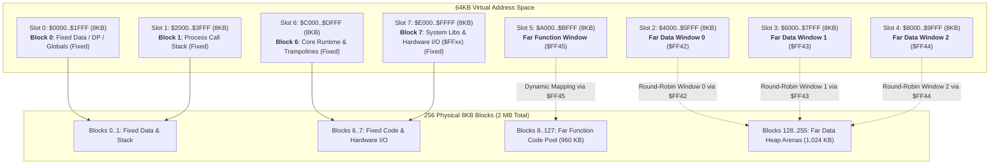
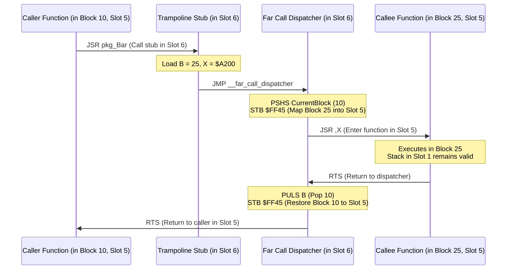

# EMBIGGEN Process Mode: Far Functions and Far Data Architecture

**Specification & Implementation Guide for MiniGolf on 64KB Small-Memory Architectures**  
*Covers Motorola 6809 / Hitachi 6309 (`gep9`), Zilog Z80 (`gepz`), and RCA CDP1802 (`gepc`)*

---

## 1. Executive Summary & Architectural Motivation

Classic 8-bit microprocessors—including the Motorola 6809, Zilog Z80, and RCA CDP1802—are fundamentally constrained by a 16-bit address bus (64 KB address space). In traditional compiled execution:
- User code and runtime libraries compete directly with application data and the process stack.
- Once a program exceeds 20–30 KB of compiled machine code, the remaining space for dynamic heap memory, btrees, string buffers, and symbol tables becomes critically cramped.
- Traditional "overlay" systems or flat banking models either suffer from severe call-overhead or force awkward manual bank management onto the programmer.

The **EMBIGGEN Process Mode** solves this limitation by pairing the Hatvan OS 8KB Paged MMU hardware specification with a segmented **Far Function** and **Far Data** compilation model in MiniGolf. 

### Key Capabilities & Invariants
1. **2 Megabyte Process Address Space**: Each process can access up to 256 physical 8KB blocks (2,048 KB total).
2. **Transparent 16-Bit Pointers & 8-Byte Slices**: Far heap data is referenced using 16-bit reference handles (`FarRef`). Slices, strings, and maps use an 8-byte descriptor (`{far_ref, offset, length, capacity}`) that unifies Near constants and stack buffers (`far_ref == 0`) with Far heap buffers (`far_ref != 0`) and enables true $O(1)$ zero-copy byte sub-slicing (`s[1:]`).
3. **Zero-Thrashing 3-Window Data Access**: Three independently mapped 8KB data windows (Slots 2, 3, and 4) operate in a round-robin / LRU configuration, allowing multi-operand operations (e.g. `s1 == s2`, `buf.Append(s)`, `memcpy(dst, src, n)`) to proceed at full native CPU bus speed without bank-switch thrashing.
4. **Transparent Far Subroutine Calls**: Every user-defined function (even `main()`) can reside in one of 120 Far Code blocks (up to 960 KB of code), mapped dynamically into Slot 5 via single-instruction-overhead trampolines in fixed memory.
5. **Fixed Stack & Direct Page**: The process stack, direct page, and fixed static variables reside in permanently mapped low memory (Slots 0 & 1), ensuring that function parameter passing, local variables, and return addresses are never swapped or invalidated.

---

## 2. 64KB Virtual Memory Map (The 8-Slot Layout)

The 64KB virtual address space of the CPU is divided into eight 8KB windows (Slots 0 through 7). The physical block mapped into each slot is controlled by the user-accessible hardware MMAP vector at `$FF40..$FF47` (see [Hatvan Hardware I/O Specification](file:///home/strick/github.com/strickyak/hatvan-os/doc/spec-hatvan-io.md#L161-L178)):

```
CPU Address Range   Slot      Default Mapping       Primary Function & Lifecycle
==================  ======    ===================   ================================================
$0000 .. $1FFF      Slot 0    Block 0 (Fixed)       Direct Page, Fixed Globals, BSS (Growing UP)
$2000 .. $3FFF      Slot 1    Block 1 (Fixed)       Process Stack (Growing DOWN from $3FFF)
$4000 .. $5FFF      Slot 2    Mapped Far Data 0     Active Far Data Window 0 (MMAP $FF42)
$6000 .. $7FFF      Slot 3    Mapped Far Data 1     Active Far Data Window 1 (MMAP $FF43)
$8000 .. $9FFF      Slot 4    Mapped Far Data 2     Active Far Data Window 2 (MMAP $FF44)
$A000 .. $BFFF      Slot 5    Mapped Far Function   Active Far Code Block (MMAP $FF45)
$C000 .. $DFFF      Slot 6    Block 6 (Fixed)       Fixed Core Runtime, Trampolines, Prelude
$E000 .. $FFFF      Slot 7    Block 7 (Fixed)       Fixed System Libraries, Traps, & Hardware I/O ($FFxx)
```



### Rationale for Fixed vs. Floating Slots
- **Fixed Slots 0 & 1 ($0000..$3FFF)**:
  - Local stack variables and procedure call frames grow down from `$3FFF`.
  - Global scalar variables, compiler temporaries, and Direct Page variables reside in `$0000..$1FFF`.
  - Because Slots 0 and 1 are never bank-switched, CPU registers, stack pointers (`S`, `SP`, `R2`), and local addresses remain valid across every far call and every far data access.
- **Fixed Slot 6 ($C000..$DFFF)**:
  - Contains the Far Function Trampoline dispatcher, Far Data round-robin manager, `far_malloc` arena allocator, and prelude runtime helpers.
  - Positioned safely below the `$E000` curtain boundary.
- **Fixed Slot 7 ($E000..$FFFF)**:
  - Governed by the Kernel Shared Memory Curtain and Hardware I/O Page.
  - Contains system call gates (`SWI2`, `OUT ($60)`), system vectors, and hardware I/O registers (`$FF00..$FFFF`).

### Hardware Address Decoding Precedence: Curtain vs. MMAP

The Hatvan OS memory management hardware enforces a strict three-tier precedence hierarchy on every memory cycle:

$$\textbf{Hardware I/O Page (\$FF00..\$FFFF)} \succ \textbf{Kernel Shared Memory Curtain (\$E000..\$FEFF)} \succ \textbf{EMBIGGEN MMAP Vector (\$0000..\$DFFF)}$$

1. **Top Precedence: Hardware I/O Page (`$FF00..$FFFF`)**:
   - The top 256 bytes are permanently hardwired to memory-mapped peripheral controllers (UART, timer, disk, DMA engine, task fuse, and MMAP vector).
   - The I/O page cannot be paged out or altered by the curtain or MMAP registers.
2. **Second Precedence: Kernel Shared Memory Curtain (`$E000..$FEFF`)**:
   - **The kernel's curtain takes strict precedence over the MMAP mechanism.**
   - The `SharedMemoryCurtain` register (at `$FF28..$FF29`, defaulting to `$E000`) establishes an impenetrable boundary at Slot 7.
   - For privileged tasks (Task 0 Kernel, Task 1 RBF, Task 2 PROCFS), memory $\ge \text{Curtain}$ directly aliases Task 0 kernel memory for zero-copy IPC and path descriptors.
   - For user processes (Task $\ge 3$), access above the curtain is strictly controlled by the operating system (hosting syscall trap gates, read-only system tables, and hardware vectors).
   - **Security Invariant**: Even if user code writes a block ID to MMAP register `$FF47` (Slot 7), the hardware curtain logic takes precedence. A user task cannot remap Slot 7 to spoof kernel syscalls, tamper with shared process descriptors, or bypass protection traps.
3. **Third Precedence: EMBIGGEN MMAP Vector (`$FF40..$FF46`, Slots 0..6)**:
   - All addresses below the curtain (`$0000..$DFFF`, Slots 0 through 6) are translated dynamically according to the task's MMAP vector.
   - User tasks may read and write `$FF40..$FF46` dynamically without kernel trap mediation.

### Architectural Harmony with the Curtain
Because the kernel curtain takes absolute precedence over Slot 7:
- **User Far Code is strictly confined to Slot 5 (`$A000..$BFFF`)** (Blocks `8..127`).
- **User Far Data is strictly confined to Slots 2, 3, and 4 (`$4000..$9FFF`)** (Blocks `128..255`).
- **User Trampolines and Core Runtime reside in Slot 6 (`$C000..$DFFF`)**, safely below `$E000`.
- As a result, the entire EMBIGGEN process model operates in complete harmony with the operating system: user far code and far data expand freely across 2 megabytes of physical blocks without ever colliding with or violating the kernel's curtain.

---

## 3. Physical Block Pool Partitioning

The 256 physical 8KB blocks available to an EMBIGGEN task are partitioned into clean, non-overlapping functional zones:

| Block Range | Count | Total Capacity | Purpose | Allocation Strategy |
| :--- | :---: | :---: | :--- | :--- |
| **`0 .. 1`** | 2 | 16 KB | Fixed Process Data & Stack | Statically assigned to Slots 0 & 1 at process startup |
| **`2 .. 5`** | 4 | 32 KB | Scratch / Initial Boot Mapping | Initialized to identity mapping `{2, 3, 4, 5}` |
| **`6 .. 7`** | 2 | 16 KB | Fixed Code, Runtime, & I/O Page | Statically assigned to Slots 6 & 7 |
| **`8 .. 127`** | 120 | 960 KB | **Far Function Code Pool** | Statically linked by compiler/linker into 8KB code blocks |
| **`128 .. 255`** | 128 | 1,024 KB (1 MB) | **Far Data Heap Blocks** | Dynamically allocated on-demand by `far_malloc` |

---

## 4. Far Data Reference Architecture (`FarRef`)

Instead of representing heap objects and strings with 24-bit or 32-bit pointers (which would require costly multi-word register pairing and double stack spills across 8-bit CPUs), EMBIGGEN encodes all far heap references into a **16-bit word**:

```
Bit 15                                                  Bit 0
+----+----+----+----+----+----+----+----+----+----+----+----+----+----+----+----+
|  1 |          Block ID (6 bits)       |            Chunk Index (9 bits)       |
+----+----+----+----+----+----+----+----+----+----+----+----+----+----+----+----+
|<------------- 7 Bits ---------------->|<-------------- 9 Bits --------------->|
|    Physical Block ID: 128 .. 255      |       16-Byte Chunk: 0 .. 511        |
```

### Bitfield Decomposition
- **Block ID (Bits 15..9, 7 bits)**:
  - Selects the physical 8KB data block in range `128 .. 255`.
  - Notice that Bit 15 is **always 1** because $128 = 10000000_2$.
- **Chunk Index (Bits 8..0, 9 bits)**:
  - Each 8KB block contains exactly $8,192 / 16 = 512$ chunks of 16 bytes each.
  - 9 bits cleanly address all 512 chunks (`0 .. 511`).
  - Byte offset within the 8KB block $= \text{ChunkIndex} \times 16 = \text{ChunkIndex} \ll 4$.

### Mathematical Properties & Nil / Near Representation
- **Unambiguous Nil & Near Distinction**: `0x0000` represents `nil` for scalar pointer types (`*T`). For slices and strings, `far_ref == 0` designates a **Near Reference** (Fixed Virtual Memory in Slots 0, 1, 6, or 7), where the companion `offset` word holds the 16-bit virtual memory address (`$0000..$FFFF`). Because all valid Far Data blocks have Bit 15 set (`128..255`), testing for Far vs. Near / Nil is a single test on the high bit:
  - 6809: `BMI is_far` or `BEQ is_near_or_nil`
  - Z80: `BIT 7, H`
  - 1802: `GLO R_high` / `SHR`
- **Intrablock Invariant**: Every allocated object (struct, string payload, slice buffer) resides entirely within a single Far Data block. No individual object spans across an 8KB block boundary.
- **Maximum Object Size**: The maximum single `malloc` payload is $8,192 - \text{ArenaHeaderSize} \approx 8,128$ bytes.

---

## 5. Round-Robin Far Data Window Management (Slots 2, 3, 4)

Slots 2, 3, and 4 (`$4000..$9FFF`, 24KB total) serve as three active data windows into the 1 MB Far Data heap.

### Runtime State
The runtime maintains a tiny 4-byte descriptor in fixed direct page RAM:
```c
struct FarWindowManager {
    uint8_t active_blocks[3]; // Physical block mapped in Slot 2, 3, and 4
    uint8_t next_evict_slot;  // Round-robin index: 0 (Slot 2), 1 (Slot 3), 2 (Slot 4)
};
```

### Resolution Algorithm (`map_far_ref`)
When user code accesses a `FarRef`:
1. Extract `block_id = (ref >> 9)` and `chunk_idx = ref & 0x1FF`.
2. **Hit Detection**:
   - If `active_blocks[0] == block_id` $\rightarrow$ Target Slot = 2 (Base `$4000`).
   - If `active_blocks[1] == block_id` $\rightarrow$ Target Slot = 3 (Base `$6000`).
   - If `active_blocks[2] == block_id` $\rightarrow$ Target Slot = 4 (Base `$8000`).
   - If hit: **Zero MMU register writes required.** Calculate virtual address immediately.
3. **Miss / Eviction**:
   - Slot to replace: `slot = next_evict_slot`.
   - Write physical block to MMU register: `*(uint8_t*)(0xFF42 + slot) = block_id`.
   - Update cache: `active_blocks[slot] = block_id`.
   - Virtual Base $= \$4000 + (\text{slot} \times \$2000)$.
   - Advance round-robin pointer: `next_evict_slot = (next_evict_slot + 1) % 3`.
4. **Virtual Address Computation**:
   $$\text{VAddr} = \text{VirtualBase} + (\text{chunk\_idx} \ll 4) + \text{field\_offset}$$

### Multi-Operand Zero-Thrashing Proof
Consider a common string comparison or append loop:
```golf
func streq(s1 string, s2 string) bool {
    if s1.Len != s2.Len { return false }
    for i := range s1.Len {
        if s1[i] != s2[i] { return false }
    }
    return true
}
```
- Suppose `s1` payload is in Block 130 and `s2` payload is in Block 142.
- At loop start:
  - First access to `s1[0]` maps Block 130 into **Slot 2** (`$4000..$5FFF`).
  - First access to `s2[0]` maps Block 142 into **Slot 3** (`$6000..$7FFF`).
- Throughout the entire execution of the loop:
  - `s1[i]` always hits Slot 2.
  - `s2[i]` always hits Slot 3.
  - **Zero MMU writes occur during the loop.** The comparison loop runs at 100% native CPU memory speed.
- In a 3-way operation like `buf.Append(s)` where `buf` reallocates into a new block:
  - `buf_old` occupies Slot 2.
  - `s` occupies Slot 3.
  - `buf_new` occupies Slot 4.
  - All three blocks remain simultaneously visible in CPU memory.

---

## 6. Slices, Strings, and Maps: The 8-Byte Unified Layout

### 6.1 The 8-Byte Slice Representation (`struct slice`)

To support $O(1)$ zero-copy sub-slicing (`s[1:]`) down to single-byte granularity and achieve seamless unification between Near static constants and Far heap buffers, EMBIGGEN expands `slice[T]` and `string` from 6 bytes to **8 bytes** (4 words):

```c
struct slice {
    word far_ref;  // 16-bit Far Reference (0 = Near / Fixed Virtual Memory)
    word offset;   // 16-bit Byte Offset within Far Block, OR 16-bit Near Virtual Address
    word length;   // 16-bit Active Element / Byte Count
    word capacity; // 16-bit Total Allocated Capacity
};
```

```
Byte Offset:   0                   2                   4                   6                   8
             +-------------------+-------------------+-------------------+-------------------+
             |  far_ref (uint16) |   offset (uint16) |   length (uint16) |  capacity (uint16)|
             +-------------------+-------------------+-------------------+-------------------+
Field Role:  | Physical Block &  | Byte offset or    | Active element    | Total element     |
             | Base Chunk Index  | Near Virt Address | count (s.Len)     | capacity (s.Cap)  |
             +-------------------+-------------------+-------------------+-------------------+
```

### 6.2 Near vs. Far Dual Semantics

The `far_ref` field acts as a high-speed discriminator:

| Mode | `far_ref` Condition | Meaning of `offset` | Virtual Memory Resolution | MMU Mapping Required? |
| :--- | :--- | :--- | :--- | :---: |
| **Near Data** | `far_ref == 0` | 16-bit Virtual Address (`$0000..$FFFF`) | Direct: $\text{VAddr} = \text{offset} + (i \times \text{sizeof}(T))$ | **No** (Direct CPU memory) |
| **Far Data** | `far_ref != 0` (Bit 15 = 1) | Byte offset relative to Base Chunk | Windowed: $\text{VAddr} = \text{Base}_{\text{slot}} + (\text{chunk} \ll 4) + \text{offset} + (i \times \text{sizeof}(T))$ | **Yes** (Cached in Slots 2, 3, 4) |

#### 1. Near Literals & Fixed Memory (`far_ref == 0`)
- **String Literals**: Constant strings embedded in program code (Slots 6 & 7) or static globals in low RAM (Slot 0) are emitted with `far_ref = 0` and `offset = (word)&literal_data`.
- **Stack Buffers**: Local arrays or stack buffers converted to slices (e.g. `slice[byte]{far_ref: 0, offset: word(&buf), length: 64, capacity: 64}`).
- **Zero Overhead**: When reading `s[i]`, the runtime checks `far_ref`. If zero, it executes an immediate flat load `*(T*)(s.offset + i * sizeof(T))` with zero MMU interaction and zero cache checks.

#### 2. Far Heap Data (`far_ref != 0`)
- Heap objects and dynamically grown slices allocated via `far_malloc` receive a valid `FarRef` in `far_ref` (Bits 15..9 = Block ID `128..255`, Bits 8..0 = Base Chunk Index `0..511`).
- Initial allocation sets `offset = 0`.
- The element at index `i` is resolved through the 3-window manager (Slots 2, 3, 4).

### 6.3 O(1) Zero-Copy Sub-Slicing (`s[start:limit]`)

Sub-slicing (e.g. `s[1:]`, `s[2:5]`, `s.Chop(start, limit)`) is completely unified and identical across both Near and Far slices:

```c
struct slice sub_slice(struct slice s, word start, word limit) {
    // Assert: start <= limit <= s.capacity
    struct slice sub;
    sub.far_ref  = s.far_ref;
    sub.offset   = s.offset + (start * sizeof(T));
    sub.length   = limit - start;
    sub.capacity = s.capacity - (start * sizeof(T));
    return sub;
}
```

#### Why This Completely Solves Sub-Slicing:
1. **Arbitrary Byte Alignment**: If `s` points to Far string `"abcdefghijklmnop"`, `s[1:]` sets `sub.offset = 1`. The subslice immediately points to `"b"` without requiring chunk realignment, memory movement, or copying.
2. **Preservation of Allocation Handle**: Because `sub.far_ref` remains untouched, the runtime always knows which physical arena and chunk owns the underlying buffer (crucial for `free()`).
3. **Identical Machine Code**: The slicing arithmetic does not branch on Near vs Far; it simply increments `offset` and decrements `length` / `capacity`.

### 6.4 Element Access & Indexing Semantics (`s[i]`)

Raw pointer arithmetic (`ptr = ptr + 1`) is forbidden on `FarRef`. All indexing goes through typed slice index operators:

#### Code Generation Lowering for `s[i]`
```c
T get_element(struct slice s, word i) {
    if (i >= s.length) {
        panic("slice index out of bounds");
    }
    
    if (s.far_ref == 0) {
        // FAST PATH: Near / Fixed Memory (ROM, Stack, Slot 0/6/7)
        return *(T*)(s.offset + (i * sizeof(T)));
    } else {
        // SLOW/CACHED PATH: Far Heap Data (Slots 2, 3, 4)
        uint8_t block_id   = s.far_ref >> 9;
        uint16_t chunk_off = (s.far_ref & 0x1FF) << 4;
        uint16_t byte_off  = chunk_off + s.offset + (i * sizeof(T));
        
        uint8_t slot       = ensure_window_mapped(block_id);
        uint16_t slot_base = 0x4000 + (slot * 0x2000);
        return *(T*)(slot_base + byte_off);
    }
}
```

### 6.5 String Maps & Interning (`smap.Smap` & `smap.Imap`)

Expanding `slice` to 8 bytes cascades cleanly into `string` and the standard map implementations in [`golflib/smap.golf`](file:///home/strick/github.com/strickyak/minigolf/golflib/smap.golf):

1. **`string` is `slice[byte]`**:
   - Every `string` variable, argument, or struct member occupies 8 bytes (`far_ref`, `offset`, `length`, `capacity`).
   - Constant string literals (`far_ref == 0`) and heap-allocated dynamic strings (`far_ref != 0`) are passed interchangeably into any function expecting `string`.

2. **`smap.Smap[T]` (Standard String Map)**:
   ```golf
   type Smap[T any] struct {
       keys   slice[string]  // 8 bytes
       values slice[T]       // 8 bytes
   }
   ```
   - Total `sizeof(Smap[T])` expands from 12 bytes to **16 bytes**.
   - The backing buffer for `keys` is an array of 8-byte `string` records.
   - String comparison `e == key` checks `e.length == key.length`, then compares characters using the 3-window manager.

3. **`smap.Imap[T]` (Interned String Map)**:
   ```golf
   type Imap[T any] struct {
       keys   slice[string]  // 8 bytes
       values slice[T]       // 8 bytes
   }
   ```
   - In `Imap`, strings are guaranteed to be interned (canonicalized).
   - Fast equality check: In near mode, `e.Base == key.Base`.
   - **In EMBIGGEN mode, fast base equality checks both `far_ref` and `offset` (a 32-bit identity comparison)**:
     ```c
     if (e.far_ref == key.far_ref && e.offset == key.offset) {
         // Identity match!
         return values[i], true;
     }
     ```
   - On 6809, this 32-bit comparison executes in just two `SUBD` instructions ($\approx 12$ cycles), preserving the ultra-fast $O(1)$ lookup speed of interned maps without performing character-by-character string comparisons!

---

## 7. Malloc Arena Architecture in Far Data Blocks

Every Far Data block in active use by the heap manager possesses an **Arena Header** located in **Chunk 0** (the first 16 bytes of the block, `$0000..$000F`):

```c
struct FarArenaHeader {
    uint16_t magic;         // 0xEB69 ('EB' = EmBiggen)
    uint8_t  block_id;      // Physical block number (128..255)
    uint8_t  flags;         // Arena state flags (0x01 = Active, 0x02 = Full)
    uint16_t free_chunks;   // Total free 16-byte chunks remaining (0..508)
    uint16_t alloc_count;   // Number of active allocations in this block
    uint16_t first_free;    // Chunk index of first free chunk (or free list head)
    uint16_t rover;         // Next-fit allocation hint
    uint16_t reserved;      // Reserved for GC / arena linkage
};
```

### Intrablock Chunk Layout
- **Chunk 0** (`$0000..$000F`, 16 bytes): Arena Header.
- **Chunks 1 .. 3** (`$0010..$003F`, 48 bytes): Chunk Allocation Bitmap (512 bits = 64 bytes total; bits 0..3 marked permanently allocated).
- **Chunks 4 .. 511** (`$0040..$1FFF`, 508 chunks = 8,128 bytes): Allocatable Payload Area.

### Allocation Header
Every allocation made by `far_malloc(nbytes)` reserves an integer number of contiguous 16-byte chunks:
$$\text{chunks\_needed} = \left\lceil \frac{\text{nbytes} + 2}{16} \right\rceil$$
The first 2 bytes of the allocated region store the allocation chunk length:
- `alloc_header.chunks`: `uint8_t` (number of chunks spanned by this allocation).
- `alloc_header.reserved`: `uint8_t`.
- Payload immediately follows at offset `+2`.

### Global Block Pool Tracker (Fixed Data in Slot 0)
The global heap manager maintains a 128-bit bitmap (16 bytes in Slot 0 BSS) representing physical blocks `128 .. 255`:
- Bit $= 0$: Physical block is free (unallocated to this process).
- Bit $= 1$: Physical block is assigned as an active Far Heap Arena.

### Allocation Lifecycle
1. **`far_malloc(nbytes)`**:
   - Compute `chunks_needed`.
   - Traverse active arenas (via round-robin data slot). If an active arena has a contiguous span of `chunks_needed`, mark bitmap and return `(block_id << 9) | chunk_idx`.
   - If no active arena can satisfy the request, allocate a fresh physical block from the 128-bit global pool, map it into an available data window, initialize `FarArenaHeader`, and allocate the payload.
2. **`far_free(FarRef ref)`**:
   - Extract `block_id = ref >> 9` and `chunk_idx = ref & 0x1FF`.
   - Map `block_id` into a data window.
   - Read allocation length from chunk header.
   - Clear corresponding bits in the chunk bitmap. Decrement `alloc_count`.
   - If `alloc_count == 0`, the entire 8KB block is freed and returned to the 128-bit global pool.

---

## 8. Far Functions & Calling Convention (Slot 5)

All user-defined functions reside in Far Code blocks `8 .. 127` and execute in virtual **Slot 5 (`$A000..$BFFF`)**.

### Fixed Trampoline Dispatcher (Slot 6)
Every far function `pkg.Foo` has a lightweight 5-byte entry stub in fixed memory (Slot 6):

```asm
; In Slot 6 (Permanently Mapped):
pkg_Foo:
    ldb   #15               ; Target Physical Block ID (e.g. Block 15)
    ldx   #$A140            ; Target Virtual Entry Point in Slot 5
    jmp   __far_call_dispatcher
```

### The Far Call Dispatcher (`__far_call_dispatcher`)
```asm
; Input: B = Target Block ID, X = Target Virtual Address in Slot 5
__far_call_dispatcher:
    lda   $FF45             ; Read current block mapped in Slot 5
    pshs  a                 ; Save previous block ID on process stack (Slot 1)
    stb   $FF45             ; Map target block into Slot 5
    jsr   ,x                ; Call the target function in Slot 5
    puls  b                 ; On return: pop previous block ID
    stb   $FF45             ; Restore previous block to Slot 5
    rts                     ; Return to caller (in Slot 5 or Slot 6)
```

### Call Flow Trace



### Key Architectural Invariants
1. **Arbitrary Nesting & Recursion**: Because the caller's previous code block ID is pushed onto the CPU hardware stack `S` (located in permanently mapped Slot 1), far calls can nest to arbitrary depths and call recursively across blocks without limitation.
2. **Uniform Stack Frames**: Local variables, spilled SSA temporaries, and function parameters are indexed relative to stack frame pointers (`U` on 6809, `IX` on Z80, `R2` on 1802). Because the stack is in Slot 1, frame access has **zero bank-switch overhead**.
3. **No Code Thrashing**: Function calls change the mapping of Slot 5 only on entry and exit. During the execution of a function, code fetches never touch MMU registers.

---

## 9. Compiler Pipeline & Code Generation Integration

To support EMBIGGEN, the MiniGolf compiler adds target architecture flags and pipeline adaptations:
- Compiler Invocation: `minigolf -m=6809 -membiggen ...` (or `-m=z80 -membiggen`, `-m=1802 -membiggen`).

### Frontend & Semantic Pass Changes
1. **Far Function Identification**:
   - All functions in `package main` and user libraries are tagged with `IsFar = true`.
   - Prelude core runtime functions (`malloc_core`, `far_call_dispatcher`, `peek/poke`, math division helpers) are tagged with `IsFar = false` and pinned to Slot 6/7.
2. **Type System Adaptation**:
   - Pointers (`*T`) to heap-allocated objects are tagged as `FarPointerType` (16-bit `FarRef`).
   - `string` and `slice[T]` types are treated as `FarSliceType` with the 8-byte layout `{word far_ref, word offset, word length, word capacity}`.
   - Map types (`smap.Smap[T]` and `smap.Imap[T]`) become 16-byte structs containing two 8-byte slices.
   - Pointers to stack variables (e.g. `&localVar`) remain `NearPointerType` (16-bit virtual address in Slot 1).
3. **Semantic Checking**:
   - Rejects pointer arithmetic on `FarPointerType` and `FarSliceType`.
   - Enforces index syntax `s[i]` for buffer accesses.

### Intermediate Representation (IR) Extensions
New SSA instructions in `ir/instruction.go`:
- `OpFarCall`: Calls a far function via its fixed trampoline stub.
- `OpFarLoad`: Resolves a `FarRef + offset` via the 3-window manager and loads a scalar value.
- `OpFarStore`: Resolves a `FarRef + offset` via the 3-window manager and stores a scalar value.
- `OpFarSliceGet`: Emits bounds check and loads element from a `FarSlice`.
- `OpFarSlicePut`: Emits bounds check and stores element into a `FarSlice`.

---

## 10. Target Architecture Implementations

### 10.1 Motorola 6809 / 6309 (`gep9`)

#### Hardware Register Access
The MMAP registers at `$FF40..$FF47` are accessed using standard 6809 memory instructions:
```asm
    sta   $FF45             ; Map code block into Slot 5 (4 cycles)
    sta   $FF42,x           ; Map data block into Slot 2+x (5 cycles)
```

#### Fast Inlined Far Load (Slot-Cached)
```asm
; Input: D = FarRef, Y = byte offset within object
; Output: A = loaded byte
    tfr   a,b
    lsrb                    ; B = Block ID (bits 15..9)
    cmpb  <active_slot_0   ; Check Slot 2
    beq   .L_hit_slot0
    cmpb  <active_slot_1   ; Check Slot 3
    beq   .L_hit_slot1
    cmpb  <active_slot_2   ; Check Slot 4
    beq   .L_hit_slot2
    jsr   __far_map_miss    ; Handle eviction and update active_slot
    ; Falls through with X = Virtual Base ($4000, $6000, or $8000)
.L_hit_slot0:
    ldx   #$4000
.L_access:
    anda  #$01              ; A = high bit of chunk index
    lsla
    lsla
    lsla
    lsla                    ; Shift chunk index << 4
    leax  a,x               ; Add chunk offset to virtual base
    lda   b,x               ; Load byte with offset
```

---

### 10.2 Zilog Z80 (`gepz`)

#### Hardware MMU Access
In `gepz`, `$FF40..$FF47` is mapped into CPU memory space:
```asm
    LD   (0xFF45), A        ; Map code block into Slot 5
```

#### Far Call Dispatcher
```asm
__far_call_dispatcher:
    LD   A, (0xFF45)        ; Read current Slot 5 mapping
    PUSH AF                 ; Push caller's block onto stack (Slot 1)
    LD   A, C               ; C = Target Block ID
    LD   (0xFF45), A        ; Map new block into Slot 5
    CALL __call_hl          ; Execute function at HL
    POP  AF                 ; Pop caller's block
    LD   (0xFF45), A        ; Restore caller's block
    RET
__call_hl:
    JP   (HL)
```

---

### 10.3 RCA CDP1802 (`gepc`)

#### Hardware MMU Access
In Hatvan 1802, the MMAP vector is accessed via memory-mapped I/O at `$FF40..$FF47` or `OUT 4` bank-latch instructions.
- Register `R2` is pinned as the hardware Process Stack in Slot 1.
- Register `R3` is the Program Counter, executing in Slot 5 (Far Functions) or Slot 6 (Trampolines).
- Register `R4` / `R5` implement the Standard Call and Return Technique (SCRT) modified to save and restore the previous block ID to `$FF45`.

---

## 11. Advanced Considerations & Optimization Strategies

### 1. Unified String Literals (Near & Far)
String constants can be compiled in two ways:
- **Near Static String Literals (`far_ref == 0`)**: Small or frequent strings embedded directly in program code (Slots 6 & 7) or fixed data (Slot 0). Directly addressed via `offset` with **zero MMU overhead** and zero heap allocation.
- **Far Constant Pool (Blocks 128..)**: Massive global text assets, dictionaries, and translation tables placed into dedicated read-only Far Data blocks and accessed via `FarRef`.

### 2. Multi-Block Allocation Support
For allocations larger than 8KB (e.g. full-screen graphics buffers or huge arrays), the allocator can reserve contiguous physical blocks (e.g. Blocks 140..143) and map them simultaneously across Slots 2, 3, and 4 (giving a contiguous 24KB flat window).

### 3. Loop Invariant Window Hoisting (LICM Integration)
If an inner loop repeatedly accesses fields of the same Far struct `p.field1`, `p.field2`, the MiniGolf SSA LICM pass hoists the window mapping outside the loop:
- Map `p.BlockID` into Slot 2 once before loop entry.
- Inside the loop, access fields directly via fixed offset `[$4000 + chunk_offset + field_offset]` with **zero runtime mapping overhead**.

### 4. Fast 32-Bit Equality for Interned String Maps (`Imap`)
Because `Imap[T]` guarantees interned strings, membership and lookup tests do not perform character-by-character string comparisons. Instead, the runtime evaluates `(e.far_ref == key.far_ref) && (e.offset == key.offset)`. On 8/16-bit architectures, this evaluates in just two 16-bit word comparisons (~12 CPU cycles).

---

## 12. Summary Comparison: Near vs. EMBIGGEN Mode

| Architectural Feature | Near Mode (Standard) | EMBIGGEN Process Mode |
| :--- | :--- | :--- |
| **Max Process Code Size** | $\approx 32\text{ KB}$ | **960 KB** (120 Far Code Blocks) |
| **Max Process Data Heap** | $\approx 16\text{ KB}$ | **1,024 KB** (128 Far Data Blocks) |
| **Pointer Size (`*T`)** | 16-bit Flat Virtual Address | **16-bit Far Reference (`FarRef`)** |
| **Slice / String Size** | 6 Bytes (`Base`, `Cap`, `Len`) | **8 Bytes (`far_ref`, `offset`, `length`, `capacity`)** |
| **Smap / Imap Struct Size** | 12 Bytes (2 $\times$ 6B slices) | **16 Bytes (2 $\times$ 8B slices)** |
| **Sub-slicing (`s[1:]`)** | Pointer increment (`Base + 1`) | **Offset increment (`offset + 1`) ($O(1)$ zero-copy)** |
| **Static String Literals** | Direct flat address | **Direct flat address (`far_ref == 0`, zero MMU overhead)** |
| **Stack Allocation** | Shared in Low/High RAM | Dedicated 8KB in **Slot 1 (`$2000..$3FFF`)** |
| **Hardware MMU Usage** | Disabled / Identity `{0..7}` | **Active 8KB Paged Vector (`$FF40..$FF47`)** |
| **Far Call Overhead** | None | 5-byte stub + $\approx 25$ CPU cycles |
| **Inner Loop Access Speed** | Native bus speed | **Native bus speed** (cached across Slots 2, 3, 4) |

---

## 13. Compiler Architecture: BIGIR & Dedicated Backends

### 13.1 Design Principles: Clean Separation of Concerns
1. **Shared Frontend & AST**:
   - The Lexer, Parser, AST structures, Type Checker, and global AST-level optimization passes (Dead Function Elimination `ast.DFE` and Dead Branch Elimination `ast.DBE`) are completely shared between Standard and EMBIGGEN modes.
   - The programmer writes identical MiniGolf syntax; whether a compilation targets flat or EMBIGGEN mode is controlled via compiler invocation flags (e.g. `minigolf -m=6809 -membiggen`).

2. **Dedicated Intermediate Representation: `BIGIR` (`bigir/`)**:
   - Rather than overloading the existing flat SSA IR (`ir/ir.go`) with complex conditional branches (`if isEmbiggen`), EMBIGGEN introduces a dedicated IR package `bigir/`.
   - `BIGIR` directly models the physical semantics of segmented 8KB memory spaces, 16-bit `FarRef` handles, 8-byte slices, 3-window data access, and far subroutine dispatching.

```mermaid
graph TD
    Src["MiniGolf Source (*.golf)"] --> Frontend["Lexer & Parser"]
    Frontend --> AST["Standard AST<br/>(Shared DFE & DBE Passes)"]

    AST -->|Standard Mode (-m=6809)| StdBuilder["Standard IR Builder"]
    StdBuilder --> StdIR["Standard SSA IR (ir/)"]
    StdIR --> StdOpt["Standard Optimizer (opt/)"]
    StdOpt --> StdBackends["Standard Backends<br/>(m6809, z80, cdp1802, amd64, cbe)"]

    AST -->|EMBIGGEN Mode (-membiggen)| BigBuilder["BIGIR Builder (bigir/)"]
    BigBuilder --> BIGIR["BIGIR SSA<br/>(8-byte Slices, FarRef, Windows)"]
    BIGIR --> BigOpt["BIGIR Optimizer & Block Packer<br/>(8KB Function Packing, Window Hoisting)"]
    BigOpt --> BigBackends["EMBIGGEN Backends<br/>(big6809, bigz80, big1802)"]
```

---

### 13.2 BIGIR Structural Specification

#### 1. Type System (`bigir.Type`)
- `TypeNearPtr`: Flat 16-bit virtual pointer (`$0000..$FFFF`) to fixed RAM (Stack in Slot 1, Direct Page in Slot 0, Fixed Runtime in Slot 6/7).
- `TypeFarRef`: 16-bit encoded handle: Bits 15..9 = Physical Block ID (`128..255`), Bits 8..0 = 16-byte Chunk Index (`0..511`).
- `TypeFarSlice[T]` & `TypeFarString`: 8-byte record `{far_ref, offset, length, capacity}`.
- `TypeFarFunc`: Far function descriptor (assigned Physical Block ID `8..127` and virtual entry point in Slot 5 `$A000..$BFFF`).

#### 2. Instruction Set
- **Memory Operations**:
  - `OpNearLoad(addr)` / `OpNearStore(addr, val)`: Direct 16-bit loads/stores without MMU interaction.
  - `OpFarLoad(far_ref, offset)` / `OpFarStore(far_ref, offset, val)`: Window-mediated access via Slots 2, 3, or 4.
  - `OpSliceGet(slice, index)` / `OpSlicePut(slice, index, val)`: Emits dual-path lowering (`far_ref == 0` fast path vs. Far window path).
  - `OpSliceChop(slice, start, limit)`: $O(1)$ zero-copy byte offset adjustment.
- **Control Flow Operations**:
  - `OpNearCall(func_addr)`: Direct 16-bit `jsr` to fixed runtime or prelude helpers in Slot 6.
  - `OpFarCall(block_id, entry_addr)`: Call mediated by Slot 6 trampoline dispatcher.
  - `OpFarReturn`: Restores caller's code block to Slot 5 (`$FF45`) and returns.

---

### 13.3 The Block Packing Pass (`bigir/pack.go`)

Because physical code blocks are limited to 8KB ($8,192$ bytes), user functions must be partitioned and assigned to specific blocks:
1. **Size Estimation**: After SSA optimization, each function's machine code size is estimated (or measured via dry-run emission).
2. **Bin Packing**:
   - Functions are packed into discrete 8KB blocks (Blocks `8 .. 127`).
   - Strongly coupled functions (e.g. caller/callee pairs in the same module) are co-located in the same 8KB block to maximize intra-block direct calls.
   - User code may optionally provide block placement pragmas (e.g. `// minigolf:block 10`).
3. **Trampoline Generation**:
   - For every packed far function, a 5-byte entry stub is generated for fixed Slot 6:
     ```asm
     pkg_func:
         ldb   #<assigned_block_id>
         ldx   #<virtual_entry_in_slot5>
         jmp   __far_call_dispatcher
     ```
4. **Intra-Block Direct Call Devirtualization**:
   - If `FuncA` calls `FuncB` and both reside in the same physical block, `OpFarCall` is converted into a direct `OpNearCall(jsr FuncB_Slot5)`, bypassing the trampoline dispatcher completely!

---

### 13.4 Dedicated Backends (`big6809/`, `bigz80/`, `big1802/`)

To preserve the stability, cleanliness, and speed of existing backends:
- Standard backends (`m6809/`, `z80/`, `cdp1802/`) remain dedicated to flat 64KB programs without any EMBIGGEN baggage.
- New modules (`big6809/`, `bigz80/`, `big1802/`) handle EMBIGGEN code generation:
  - **Output Generation**: Emits discrete 8KB binary chunks (`block_008.bin` .. `block_NNN.bin`), the fixed Slot 6 runtime image, and a unified Hatvan executable manifest.
  - **Window Caching**: Allocates and caches MMU registers (`$FF42..$FF44`) for Far Data dereferencing.
  - **Calling Conventions**: Manages Slot 5 mapping (`$FF45`) and stack-saved block IDs.

