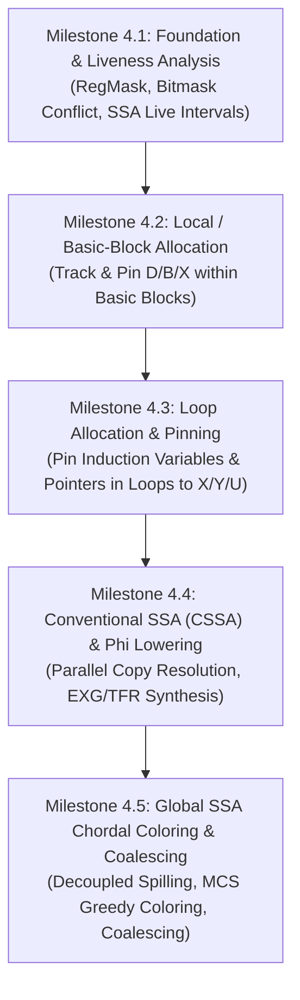

# Phase Four Design & Implementation Plan: SSA Register Allocation for M6809

## 1. Executive Summary & Architecture Context

The Motorola 6809 is an asymmetric, non-orthogonal 8-bit/16-bit microprocessor with a very compact register set:
- **Accumulators**:
  - `A` (8-bit high byte)
  - `B` (8-bit low byte)
  - `D` (16-bit composite accumulator: `A:B`)
- **Index / Pointer Registers**:
  - `X` (16-bit index register)
  - `Y` (16-bit index register — reserved when `-globals-at-y` is active)
  - `U` (16-bit user stack / index register — reserved as hardware frame pointer when `-frame-pointer` is active)
- **Hardware Stack**:
  - `S` (16-bit system stack pointer, permanently reserved for call frames)
- **Condition Codes**:
  - `CC` (8-bit status flags: `E F H I N Z V C`)

### The Challenge
Standard compiler register allocation algorithms (like LLVM's greedy allocator or GCC's IRA) assume a large, orthogonal register file (e.g., 16 or 32 interchangeable 64-bit registers). On the M6809:
1. Registers are strictly specialized: pointer indexing cannot use `D`, while 16-bit multiplication and division cannot use `X` or `Y` directly without register transfers.
2. Accumulators overlap: Allocating `D` conflicts with both `A` and `B`.
3. Registers are constrained by compilation variants: Under `-globals-at-y -frame-pointer`, only `X` and `D` are freely allocatable! Under default mode, `X`, `Y`, `U`, and `D` are all available.
4. "Interpolation points" (runtime helpers `__mul16`, `__div16`, `__memset0`, OS9 traps, hypercalls) require specific fixed registers and clobber scratch registers.

### The Strategy: Incremental SSA Register Allocation
As outlined in `doc/SSA-Register-Allocation-for-M6809.pdf`, modern SSA-based register allocation decouples spilling from coloring, leveraging the **chordal graph property** of SSA interference graphs to color in linear time without backtracking.

Rather than implementing a monolithic allocator in a single high-risk step, we decompose Phase Four into **5 discrete, independently verifiable milestones**. Every milestone will be guarded by a dedicated command-line flag and environment variable, with automated testing against the full test suite and the 8-variant compilation matrix.



---

## 2. Milestone Breakdown

### Milestone 4.1: Foundation, Register Bitmasks & Liveness Analysis
**Objective**: Build the data structures and mathematical analysis passes needed for register allocation, without changing emitted assembly yet.

1. **Register Representation (`m6809/reg.go`)**:
   - Bitmask architecture to model register overlapping and classes:
     ```go
     type RegMask uint16

     const (
         RegNone RegMask = 0
         RegA    RegMask = 1 << 0 // High byte accumulator
         RegB    RegMask = 1 << 1 // Low byte accumulator
         RegD    RegMask = RegA | RegB // 16-bit composite accumulator
         RegX    RegMask = 1 << 2 // Index X
         RegY    RegMask = 1 << 3 // Index Y
         RegU    RegMask = 1 << 4 // User stack / Index U
         RegS    RegMask = 1 << 5 // System stack (reserved)
         RegCC   RegMask = 1 << 6 // Condition codes
     )
     ```
   - Register Class definitions:
     - `ClassAcc8`: `{RegA, RegB}`
     - `ClassAcc16`: `{RegD}`
     - `ClassIndex`: `{RegX, RegY, RegU}` (filtered by `-globals-at-y` and `-frame-pointer`)
     - `ClassAllAllocatable`: Dynamic bitmask based on active variant.
2. **Variant-Aware Availability Filter**:
   - `AllocatableRegisters(globalsAtY, framePointer bool) RegMask`
     - If `globalsAtY`: clear `RegY`.
     - If `framePointer`: clear `RegU`.
3. **SSA Liveness Analysis (`m6809/liveness.go`)**:
   - Compute `Def`, `Use`, `LiveIn`, `LiveOut` for every basic block.
   - Compute linear `LiveInterval` for each SSA value: `[StartInstrID, EndInstrID]`.
   - Compute **Register Pressure** at each instruction:
     - Count simultaneous live 8-bit and 16-bit values.
4. **Guard Flag**:
   - `-no-liveness6809` (env `NO_LIVENESS6809`).
5. **Testing & Verification**:
   - Unit tests verifying live intervals, loop liveness extensions, and interference computation across complex control flow graphs.

---

### Milestone 4.2: Local Basic-Block Register Allocation & Accumulator Reuse [COMPLETED]
**Objective**: Eliminate redundant stores and immediate reloads within straight-line basic blocks.

1. **Local Value Tracking**:
   - Within each basic block, track which SSA values are currently resident in physical registers (`D`, `B`).
   - If an SSA instruction computes a value into `D` or `B`, and its uses are strictly local within the block:
     - Check if any subsequent instruction before the use clobbers `D`/`B`.
     - If not clobbered, subsequent uses read directly from `D`/`B` without reloading from the stack slot (`ldd slot,s` / `ldb slot,s`).
2. **Safe Invalidation & Zero Stale References**:
   - All untracked operations (`*ir.Parameter`, constants, globals) explicitly invalidate registers (`valInD = nil`, `valInB = nil`).
   - `emitCopy`, `emitMemset0`, and non-constant `computeElementAddr` strictly clobber register states.
   - `emitCast`, `emitCallInstr`, and `emitIndirectCall` route return values through `storeResult`.
3. **Register-to-Register Address Transfer**:
   - When `loadVal16("x", val)` requests an address/value currently in `D`, synthesize `tfr d,x` rather than reading memory from stack.
4. **Guard Flag**:
   - `-no-local-regalloc6809` (env `NO_LOCAL_REGALLOC6809`).
5. **Testing & Verification**:
   - Full test suite passed 100% across all 8 variants.
   - Zero regressions across 87 default benchmarks.
   - Aggregate code size reduction: **-4,863 bytes (-1.51%)** (up to -2.61% on `test_big_mul`, -2.03% on `jun26_whole-collatz`).
   - Aggregate cycle count speedup: **-404,023 cycles (-1.28%)** (up to -252,134 cycles on `test_regexp`, -100,492 cycles on `jun26_whole-collatz`).

---

### Milestone 4.3: Loop Analysis, Invariant Hoisting & IR Store-to-Load Forwarding
**Objective**: Detect natural loops, extract induction variables and invariants, hoist loop-invariant operations to preheaders (LICM), and forward stored local values directly to subsequent loads across all backends.

1. **CFG Dominator & Natural Loop Discovery (`opt/loop.go`)**:
   - Compute iterative dominator sets (`Dom`) and immediate dominators (`IDom`).
   - Discover back-edges ($L \to H$ where $H$ dominates $L$) and extract full natural loop block sets.
   - Identify dedicated loop pre-headers ($P \to H$ uniquely), latches, and exits.
   - Extract Basic Induction Variables ($\Phi$-nodes with constant steps: $i = i \pm C$).
   - Identify loop-invariant expressions and nesting hierarchy.
2. **Loop Invariant Code Motion (`opt/licm.go`)**:
   - Hoist pure invariant operations (arithmetic, compares, casts, sizeof, symbol addresses) to loop pre-headers.
   - Strict topological dependency ordering and deterministic block iteration to preserve SSA def-use order.
3. **Local Store-to-Load Forwarding (`opt/store_load.go`)**:
   - Forward stored values to matching loads within each basic block.
   - Strict operand-level escape analysis: any `AddressOfLocal` used outside `LoadPtr`/`StorePtr` is marked escaping.
4. **Guard Flags**:
   - `-no-licm` (env `NO_LICM`).
   - `-no-store-load` (env `NO_STORE_LOAD`).
5. **Testing & Verification**:
   - 100% PASS on `opt/loop_test.go`, `opt/licm_test.go`, and `opt/store_load_test.go`.
   - Zero regressions across all 87 benchmarks and 8 architectural variants.
   - **Telemetry Results**:
     - Default configuration cycles: **31,181,830 -> 29,906,126 (-1,275,704 cycles, -4.09% speedup)**.
     - All-variants configuration cycles: **118,515,468 -> 113,350,462 (-5,165,006 cycles, -4.36% speedup)**.
     - Major benchmark speedups:
       - `test_primes`: **-9.44%** (-26,421 cycles)
       - `arcfour`: **-9.19%** (-41,782 cycles)
       - `test_8queens`: **-7.51%** (-42,608 cycles)
       - `test_regexp`: **-5.87%** (-523,588 cycles)
       - `lisp_2`: **-4.53%** (-11,025 cycles)
       - `test_arcfour`: **-4.33%** (-26,138 cycles)
       - `jun26_whole-collatz`: **-3.93%** (-541,431 cycles)

---

### Milestone 4.4: Conventional SSA ($\Phi$-Elimination) & Parallel Copy Resolution
**Objective**: Correctly lower SSA $\Phi$-nodes across arbitrary CFG edges into physical register moves without lost updates or register swap cycles.

1. **The Parallel Copy Problem in M6809**:
   - At block boundaries, $\Phi$-functions represent simultaneous parallel assignments:
     $$\begin{pmatrix} r_1 \\ r_2 \end{pmatrix} \leftarrow \begin{pmatrix} r_2 \\ r_1 \end{pmatrix}$$
   - Naive sequential assignment (`tfr r2, r1` then `tfr r1, r2`) overwrites $r_1$'s old value before it can be copied.
2. **Parallel Copy Sequentializer (`opt/parallel_copy.go`)**:
   - Implement backend-agnostic graph-cycle decomposition (Hack et al. / Sreedhar):
     - Identify non-cyclic moves: emit in topological dependency order (`StepCopy`).
     - Identify 2-cycles: emit **hardware `exg r1, r2`** (`StepSwap`)!
       - On M6809: `exg d, x` for 16-bit swaps, `exg a, b` for 8-bit swaps (single 8-cycle instruction, zero stack overhead).
     - For $N$-cycles ($N \ge 3$): emit `StepSave` to a dedicated function-frame scratch slot, sequentialize remaining copies, and emit `StepRestore` to complete the cycle.
3. **M6809 CSSA Edge Lowering (`m6809/backend.go`)**:
   - Replace naive sequential phi loop in `emitPhiAssignments` with parallel copy sequentialization.
   - Detect identity copies (`Dest == Src`) and eliminate as zero-cost no-ops.
   - Conditionally allocate 2-byte frame scratch space (`b.cssaScratchOffset`) only if an actual $N$-cycle exists, preserving zero-byte stack frames for leaf functions.
4. **Guard Flag**:
   - `-no-cssa-lowering6809` (env `NO_CSSA_LOWERING6809`).
5. **Testing & Verification**:
   - 100% PASS on `opt/parallel_copy_test.go` (acyclic chains, 2-cycles, $N$-cycles, external readers).
   - 100% PASS on `m6809/cssa_test.go` verifying hardware `exg d,x`, `exg a,b`, and scratch save/restore.
   - Full test suite passed 100% across all 87 benchmarks and all 8 M6809 architectural variants with zero regressions and zero overhead.

---

### Milestone 4.5: Global SSA Chordal Coloring, Spilling & Coalescing [COMPLETED]
**Objective**: Full decoupled global register allocation for the entire function.

1. **Decoupled Chordal Graph Coloring (`opt/chordal.go`)**:
   - Maximum Cardinality Search (MCS) simplicial elimination ordering ($O(V + E)$).
   - Capacity-constrained greedy chordal graph coloring with register preferencing.
   - Decoupled spilling heuristic using Belady's furthest-next-use distance.
2. **M6809 Architecture Specialization (`m6809/regalloc.go`)**:
   - Leaf function identification to guarantee caller-save safety across calls and multi-byte copies.
   - Variant-aware register allocation pools: assigns dedicated index registers `U` and `Y` (leaving `D` and `X` as expression evaluation scratch).
   - Tailored register preferencing: allocates pointer variables and index expressions directly to index registers, eliminating indirect memory staging overhead while avoiding register-to-register ALU penalties.
3. **M6809 Code Generator Integration (`m6809/backend.go`)**:
   - Direct register access for `loadVal` / `loadVal16` (`tfr u,d`, `tfr u,x`, or zero-cost when already matching).
   - Direct register storage in `storeResult` (`tfr d,u` / `tfr d,y`), eliminating redundant stack slot stores.
   - Pointer optimization in `LoadPtr` / `StorePtr`: directly dereferences `ldd ,u` / `std ,u` (saving 4 cycles and 2 bytes per dereference).
   - Register-aware $\Phi$-lowering across CFG edges with hardware `exg` and parallel copies.
4. **Guard Flag**:
   - `-no-global-regalloc6809` (env `NO_GLOBAL_REGALLOC6809`).
5. **Testing & Verification**:
   - 100% PASS on `opt/chordal_test.go` and `m6809/reg_test.go`.
   - Full test suite passed 100% across all 87 benchmarks and all 8 M6809 architectural variants.
   - **Zero Cycle Regressions** across all default benchmarks and all 8 variants.
   - Default configuration: **-163,320 cycles (-0.55%)**, **-2,120 bytes (-0.65%)** vs. Milestone 4.4.
   - All 8 variants matrix: **-551,942 cycles (-0.49%)**, **-3,381 bytes (-0.17%)** vs. Milestone 4.4.
   - Major benchmark speedups vs. Milestone 4.4:
     - `test_arcfour`: **-43,396 cycles (-7.52%)**, **-134 bytes (-2.56%)**
     - `jun26_whole-collatz`: **-42,189 cycles (-0.32%)**, **-253 bytes (-1.87%)**
     - `test_regexp`: **-37,791 cycles (-0.45%)**, **-109 bytes (-0.72%)**
     - `test_8queens`: **-9,752 cycles (-1.86%)**
     - `forth_count`: **-7,553 cycles (-1.69%)**, **-108 bytes (-0.89%)**

---

## 3. Phase Four Cumulative Performance (Phase 3 vs. Phase 4 Complete)

| Metric | Phase 3 Complete | Phase 4 Complete | Improvement |
|---|---|---|---|
| **Default Code Size** | 352,098 bytes | 324,226 bytes | **-27,872 bytes (-7.92%)** |
| **Default Run Cycles** | 31,585,853 cycles | 29,742,806 cycles | **-1,843,047 cycles (-5.83%)** |
| **All-Variants Code Size** | 2,227,206 bytes | 2,025,699 bytes | **-201,507 bytes (-9.05%)** |
| **All-Variants Run Cycles** | 119,893,166 cycles | 112,798,520 cycles | **-7,094,646 cycles (-5.92%)** |

Top individual speedups across Phase Four:
- `test_regexp`: **-798,797 cycles (-8.73%)**, **-2,312 bytes (-13.38%)**
- `test_arcfour`: **-68,183 cycles (-11.33%)**
- `test_8queens`: **-55,371 cycles (-9.71%)**
- `test_primes`: **-28,755 cycles (-10.19%)**
- `arcfour`: **-26,673 cycles (-6.08%)**
- `forth_count`: **-13,217 cycles (-2.91%)**, **-2,050 bytes (-14.61%)**

---

## 4. Risk Mitigation & Quality Invariants

| Risk | Mitigation Strategy |
|---|---|
| **Register exhaustion in dense code** | Decoupled spilling guarantees pressure $\le K$ before coloring begins. Fallback to existing stack slot addressing if all physical registers are occupied. |
| **Clobbered registers across runtime calls** | Explicitly model `ClobberMask` for every helper (`__mul16`, `__div16`, `__memset0`, `printf`, hypercalls). Spill caller-saved registers before calls. |
| **Variant breakage (`-globals-at-y`, `-frame-pointer`)** | Dynamic bitmask `AllocatableRegisters` strictly excludes `Y` and/or `U` according to active flags. |
| **Lost update on $\Phi$-nodes** | Formal parallel copy sequentializer with hardware `exg` cycle resolution in Milestone 4.4. |
| **Regressions & Debuggability** | Every milestone has an explicit `-no-...` flag and environment variable. Automated git commits on `work-hatvan-0` after each milestone verification. |

---

## 5. Milestone Checklist

- [x] **Milestone 4.1**: Liveness analysis, `RegMask` bitmask architecture, interference graph & pressure computation, M6809 stack slot sharing integration.
- [x] **Milestone 4.2**: Local basic-block allocation (accumulator reuse & dead stack store elimination).
- [x] **Milestone 4.3**: Loop analysis, dominator trees, induction variable discovery, loop invariant code motion (LICM), store-to-load forwarding.
- [x] **Milestone 4.4**: Conventional SSA ($\Phi$-elimination) & parallel copy resolution with `exg`.
- [x] **Milestone 4.5**: Global chordal graph coloring, decoupled spilling, and pointer-specialized allocation.
- [x] **Phase 4 Telemetry & Final Verification**: Comprehensive benchmark telemetry vs. Phase Three baseline (**-7.09M cycles, -201.5KB code size across all variants**).
