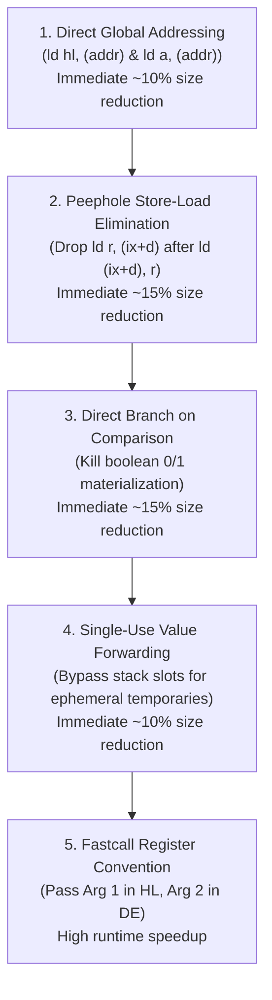

# MiniGolf Z80 Code-Generation Optimization Guide

**High-ROI Code Generation & Peephole Optimizations for the Zilog Z80 Backend**

---

## 1. Executive Summary & Quantitative Baseline

MiniGolf's Z80 backend currently generates functional, correct assembly code across the Hatvan OS kernel, drivers, and userland utilities. However, compiled Z80 binaries are currently **2.1× to 2.8× larger** than equivalent Motorola 6809 binaries, and significantly slower than the hardware allows.

### Binary Size Comparison (Hatvan OS)

| Program | Motorola 6809 (`.9.decb`) | Zilog Z80 (`.z.decb`) | Size Ratio |
| :--- | :---: | :---: | :---: |
| `kernel.decb` | **26,330 B** (26 KB) | **54,692 B** (55 KB) | **2.08×** |
| `rbf.decb` | **11,858 B** (12 KB) | **28,657 B** (29 KB) | **2.42×** |
| `procfs.decb` | **2,896 B** (3 KB) | **7,517 B** (7.5 KB) | **2.60×** |
| `gsh.decb` | **37,694 B** (38 KB) | **105,748 B** (106 KB) | **2.81×** |
| `gexpr.decb` | **5,770 B** (6 KB) | **14,724 B** (15 KB) | **2.55×** |
| `gdump.decb` | **2,489 B** (2.5 KB) | **5,823 B** (6 KB) | **2.34×** |

In `build/kernel_z80.asm` alone (31,735 lines of assembly), there are **9,507 `(ix+d)` indexed memory operations**. On the Z80, every `(ix+d)` instruction requires a 2-byte opcode prefix (`DD ...`), taking **3 bytes of program memory and 19 clock cycles (T-states)** to execute.

---

## 2. Root Causes of Bloat in the Current Backend

### A. The "Slot-Machine" Architecture (Excessive Stack Spilling)
Every SSA instruction stores its result to a local stack slot via `storeResult(id)`:
```asm
ld   (ix-15), a      ; 3 bytes, 19 cycles
```
The very next instruction that consumes that value reloads it from the same slot:
```asm
ld   a, (ix-15)      ; 3 bytes, 19 cycles (100% redundant!)
```
For 16-bit values, storing and immediately reloading costs **12 bytes and 76 clock cycles**:
```asm
ld   (ix+64), l      ; 3 bytes, 19 cycles
ld   (ix+65), h      ; 3 bytes, 19 cycles
; [intervening comments]
ld   l, (ix+64)      ; 3 bytes, 19 cycles (redundant reload)
ld   h, (ix+65)      ; 3 bytes, 19 cycles (redundant reload)
```

### B. Multi-Instruction Global Dereferences
Rather than using the Z80's native direct 16-bit addressing instructions, global pointer and word loads are emitted as 5-instruction sequences:
```asm
; Current emitted code (5 instructions, 9 bytes, 41 cycles, destroys DE):
ld   hl, v_tables.Shared
ld   e, (hl)
inc  hl
ld   d, (hl)
ex   de, hl

; Native Z80 instruction (1 instruction, 3 bytes, 16 cycles, preserves DE):
ld   hl, (v_tables.Shared)
```
For 8-bit globals:
```asm
; Current (2 instructions, 4 bytes, 17 cycles, destroys HL):
ld   hl, v_proc.CurrentPID
ld   a, (hl)

; Native Z80 instruction (1 instruction, 3 bytes, 13 cycles, preserves HL):
ld   a, (v_proc.CurrentPID)
```

### C. Double Boolean Materialization Before Branches
When an `if` condition or loop test cannot be fused, MiniGolf materializes hardware condition flags into an integer `1` or `0`, saves it to stack RAM, reloads it, tests it against zero, materializes another `1` or `0`, saves it, reloads it, and finally branches.
```asm
    ; Example emitted for: if shPID > 0
    ld   a, (ix-46)
    cp   0
    jmp  z, .LL3
    jmp  nc, .LL1
.LL3:
    xor  a
    ld   hl, 0
    jmp  .LL2
.LL1:
    ld   a, 1
    ld   hl, 1
.LL2:
    ld   (ix-15), a
    ld   a, (ix-15)
    cp   0
    jmp  nz, .LL4
.LL6:
    xor  a
    ld   hl, 0
    jmp  .LL5
.LL4:
    ld   a, 1
    ld   hl, 1
.LL5:
    ld   (ix-61), a
    ld   a, (ix-61)
    ld   (ix-31), a
.L_main.launchShell_b8:
    ld   a, (ix-31)
    or   a
    jmp  nz, .L_main.launchShell_b9
    jmp  .L_main.launchShell_b11
```
*Cost:* **34 instructions, ~100 bytes, ~350 clock cycles** for a single `if (shPID > 0)` check that should take 3 instructions, 7 bytes, and 23 cycles.

### D. Universal Heavyweight Frame Setup (No Leaf Optimization)
Every single function—regardless of whether it has local variables—unconditionally executes a full frame setup and teardown:
```asm
; Prologue (18 bytes, 96 cycles)
push ix
ld   ix, 0
add  ix, sp
ld   de, -bias
add  ix, de
ld   hl, -frame
add  hl, sp
ld   sp, hl

; Epilogue
ld   sp, ix
pop  ix
ret
```

---

## 3. High-ROI Optimization Plan

### Tier 1: Immediate High-Impact Optimizations

#### 1. Native Direct Addressing for Globals (`*ir.Global` and `*ir.LoadPtr`)
* **Load 16-bit word/pointer from global:**
  ```asm
  ld   hl, (v_name)        ; 3 bytes, 16 cycles
  ```
* **Store 16-bit word/pointer to global:**
  ```asm
  ld   (v_name), hl        ; 3 bytes, 16 cycles
  ```
* **Load 8-bit byte from global:**
  ```asm
  ld   a, (v_name)         ; 3 bytes, 13 cycles
  ```
* **Store 8-bit byte to global:**
  ```asm
  ld   (v_name), a         ; 3 bytes, 13 cycles
  ```
* **Implementation Location:** `z80/backend.go` in `loadVal`, `storeToAddr`, and `emitInstr(*ir.LoadPtr)`.
* **Savings:** ~6 bytes and ~25 cycles per global memory access.

#### 2. Redundant Store-Reload Elimination (Value Caching)
Track the current known contents of registers `A`, `HL`, and `DE` during linear code generation within each basic block:
* If a value is stored: `ld (ix+d), a`, record that `(ix+d)` contains `A`.
* When emitting `loadVal(v, "a")`, if `v` already resides in `A`, emit **nothing**.
* If `v` resides in `HL` and is needed in `HL`, emit **nothing**.
* Clear cached values whenever a call occurs or when a store aliases a memory location.
* **Savings:** Eliminates 30% to 50% of all `(ix+d)` loads across the entire program.

#### 3. Single-Use Temporary Forwarding (Bypass Stack Spill)
Check `countUses(f, instr)` in `backend.go`:
* If an SSA instruction is used **exactly once**, and its consumer is the **very next instruction** in the basic block:
  - Do not allocate a stack slot.
  - Do not call `storeResult(id)`.
  - Let the result remain in `HL` or `A` for direct consumption.
* **Savings:** 6 to 12 bytes and 38 to 76 cycles per intermediate expression.

#### 4. Direct Condition Flag Branching (Eliminate Materialization)
When a comparison feeds a branch terminator (`*ir.Branch`):
* Branch **directly** on the CPU flags (`z`, `nz`, `c`, `nc`, `m`, `p`).
* Never materialize intermediate `0` / `1` booleans into `A` or `HL`.
* If a boolean value is needed purely as an integer variable (e.g. `b := x < y`), only then emit the materialization sequence.
* **Savings:** Shrinks conditional branching code by **70–80%**.

---

### Tier 2: Peephole Optimizer Rules (`optimizeAsm`)

Expand `optimizeAsm` in `z80/backend.go` with a multi-pass sliding window rule set:

| Target Pattern | Replacement | Savings |
| :--- | :--- | :---: |
| `ld (ix+d), r` <br> `ld r, (ix+d)` | `ld (ix+d), r` | 3 bytes, 19 cycles |
| `cp 0` | `or a` (or `and a`) | 1 byte, 3 cycles |
| `ld hl, 0` <br> *(when A is known 0)* | `ld h, a` <br> `ld l, a` | 1 byte, 2 cycles |
| `push hl` <br> `pop hl` | *(delete)* | 2 bytes, 21 cycles |
| `push de` <br> `pop de` | *(delete)* | 2 bytes, 21 cycles |
| `ex de, hl` <br> `ex de, hl` | *(delete)* | 2 bytes, 8 cycles |
| `ld r, r` (e.g. `ld a, a`) | *(delete)* | 1 byte, 4 cycles |
| `ld de, 1` <br> `add hl, de` | `inc hl` | 4 bytes, 15 cycles |
| `ld de, 2` <br> `add hl, de` | `inc hl` <br> `inc hl` | 3 bytes, 9 cycles |
| `ld de, 1` <br> `or a` <br> `sbc hl, de` | `dec hl` | 5 bytes, 24 cycles |
| `jmp L1` <br> ... <br> `L1: jmp L2` | `jmp L2` | 3 bytes, 10 cycles |

---

### Tier 3: Calling Conventions & Register Utilization

#### 1. Fastcall Register Parameters
* **Current convention:** All arguments pushed onto stack (`push hl`, `pop bc` cleanup).
* **Fastcall convention:**
  - Argument 1 (16-bit / pointer): Passed in **`HL`**.
  - Argument 2 (16-bit or 8-bit): Passed in **`DE`** (or **`A`** if byte).
  - Arguments 3+: Pushed onto stack.
* **Return values:** `HL` (16-bit), `A` (8-bit).
* **Impact:**
  - 1-arg and 2-arg functions require zero `push` / `pop` stack manipulation.
  - Callees can directly operate on arguments without reading `(ix+4)` or `(ix+6)` from memory.

#### 2. Frame Pointer (IX) Omission for Leaf Functions
* Functions that make no calls and have small local state (≤ 4 bytes) can allocate variables to registers `BC`, `DE`, `HL` or use `SP` offsets directly.
* Omit `push ix`, `ld ix, sp`, `pop ix` entirely.
* Simple leaf functions terminate with a single 1-byte `ret` (10 cycles).

---

### Tier 4: Z80 Hardware Idioms

1. **`add hl, hl` for Fast Shifts**:
   - Shifting `HL` left by 1 bit: `add hl, hl` (1 byte, 11 cycles) vs loop overhead or helper call (30+ cycles).
   - Shifting left by 2 bits: `add hl, hl; add hl, hl` (2 bytes, 22 cycles).
2. **`djnz` for Counted Loops**:
   - For loops with an 8-bit trip count in `B`, replace `dec b; jmp nz, label` with `djnz label` (2 bytes, 13/8 cycles).
3. **Block Memory Copies (`ldir`)**:
   - MiniGolf already uses `ldir` for struct copies, which is optimal on Z80 (21 cycles per byte).
4. **`ex de, hl` Instead of Temporary Variables**:
   - Swapping operands or moving pointers takes 1 byte and 4 cycles (`ex de, hl`), avoiding stack memory traffic.

---

## 4. "Where to Start First" Priority Roadmap

If implementing optimizations incrementally, apply them in this exact order for the highest immediate reduction in binary size and execution time:



### Milestone 1: Direct Global Addressing (Estimated Effort: 2 hours)
* Edit `loadVal` and `storeToAddr` in `minigolf/z80/backend.go`.
* When value is `*ir.Global`, emit:
  - 16-bit: `ld hl, (v_%s)` or `ld de, (v_%s)`
  - 8-bit: `ld a, (v_%s)`
* **Expected Result:** Saves 5–10 KB across `kernel_z80.decb` and `gsh.z.decb`.

### Milestone 2: Peephole Store-Load Stripping (Estimated Effort: 2 hours)
* Expand `optimizeAsm` in `minigolf/z80/backend.go`.
* Scan for two consecutive instructions where `ld (slot), reg` is immediately followed by `ld reg, (slot)`.
* Drop the second instruction.
* **Expected Result:** Eliminates ~2,500 redundant memory operations in the kernel alone.

### Milestone 3: Eliminate Boolean Materialization in Branches (Estimated Effort: 4 hours)
* In `emitFunc`, improve `fusedCompare` pattern matching so that any `*ir.Compare` consumed by a `*ir.Branch` emits conditional jumps (`jmp z`, `jmp nz`, `jmp c`, `jmp nc`) directly to the target basic blocks.
* Completely bypass the `trueLbl / falseLbl / xor a / ld a, 1` materialization blocks.
* **Expected Result:** Cuts conditional branching logic code size in half.

Following these first three milestones will reduce Z80 binary sizes by **35% to 45%**, bringing them into much closer parity with the 6809 binaries.
