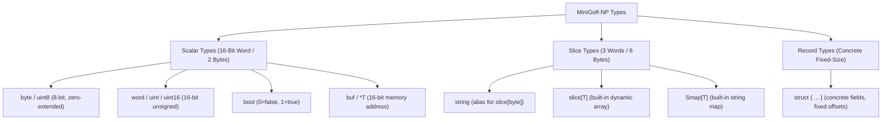

# MiniGolf-NP Formal Language & Compilation Specification

**Language Name:** MiniGolf-NP (NP Source Language)  
**Target Architecture:** NPCode Virtual Machine (`*.npc`) / NP Assembly (`*.npasm`)  
**Specification Version:** 1.0  
**Date:** October 2026  
**Document:** `np-runtime/minigolf_spec.md`  
**Reference Implementations:**  
- MiniGolf Language Reference: `/home/strick/github.com/strickyak/minigolf/doc/minigolf_lang.md`  
- MiniGolf AST: `/home/strick/github.com/strickyak/minigolf/ast/ast.go`  
- NP Code Generator: `/home/strick/github.com/strickyak/minigolf/np/codegen.go`  
- NP Runtime Libraries: `/home/strick/github.com/strickyak/minigolf/np-lib/prelude.golf`, `slice.golf`, `smap.golf`, `regexp.golf`, `btree.golf`, `rbtree.golf`  
- Bytecode ISA: `np-runtime/design.md`, `np-runtime/opcodes.py`  
- Assembler / Disassembler / Emulator: `np-runtime/npasm.py`, `np-runtime/npdis.py`, `np-runtime/npvm.py`  

---

## 1. Introduction & Objectives

**MiniGolf-NP** is an intentional, strictly defined subset of the MiniGolf programming language tailored specifically as the high-level systems source language for the **NPCode Virtual Machine** and 6809/6309 NitrOS-9 environments.

### 1.1 Core Directives
1. **Strict Subset of Go Syntax**: Every valid MiniGolf-NP program is valid Go syntax and can be formatted with standard `gofmt`.
2. **C99/Low-Level Systems Semantics**: No garbage collection, no runtime reflection, and no hidden memory allocation.
3. **Unified 3-Word Slices (`{ Base, Cap, Len }`)**: Slices represent dynamic sequences of any type, `string` is an alias for `slice[byte]`, and dictionaries (`Smap[T]`) are implemented as linear alternating key-value slices.
4. **Deterministic 16-Bit Word Execution**: Stack slots and scalar variables are uniform 16-bit words (`uint16_t`). Slices occupy 3 consecutive words (6 bytes).
5. **Direct 1:1 Code Generation to NPCode ISA**: Every syntactic construct in MiniGolf-NP translates into a predictable sequence of NPCode bytecode instructions without runtime overhead.

---

## 2. Lexical Grammar

MiniGolf-NP source code is encoded in 7-bit ASCII or UTF-8.

### 2.1 Comments & Semicolons
- **Line Comments:** `// comment to end of line`
- **Block Comments:** `/* comment */`
- **Automatic Semicolon Insertion:** Identical to Go and MiniGolf. A newline automatically acts as a semicolon if the previous token is an identifier, a literal, `break`, `continue`, `return`, `++`, `--`, `)`, `]`, or `}`.

### 2.2 Identifiers & Keywords
- **Identifiers:** `[A-Za-z_][A-Za-z0-9_]*`
- **Keywords:**
  ```text
  package   import    func      var       const     type      struct
  if        else      for       range     switch    case      default
  return    break     continue  goto
  ```
- **Builtin Type Identifiers:**
  ```text
  byte      word      uint      bool      string    buf       noreturn
  ```
  *(Note: `int` and `int16` are recognized as Go/MiniGolf tokens but are strictly forbidden in MiniGolf-NP; the code generator requires unsigned `word` or `byte` and will raise a compile-time panic if signed `int` is used).*
- **Builtin Constants & Functions:**
  ```text
  true      false     nil       len       cap       make      append
  println   print     alloc     free      peek      poke      zalloc
  ```

### 2.3 Literals
- **Integer Literals:**
  - Decimal: `42`, `1000`
  - Hexadecimal: `0x2000`, `$2000`
  - Binary: `0b1010`, `%1010`
  - Octal: `0o755`, `@755`
  - Character Literals: `'A'`, `'\n'`, `'\t'`, `'\\'`, `'\''` (evaluated as 16-bit integer values)
- **String Literals:**
  - Interpreted: `"hello\r\n"` (supports standard escapes: `\n`, `\r`, `\t`, `\\`, `\"`, `\0`, `\xHH`)
  - Raw (Backtick): `` `raw multiline text` `` (no escape processing)
  - String literals are immutable and emitted into the read-only NPCode String Pool.

---

## 3. Type System

MiniGolf-NP is statically and strongly typed. All types have a fixed byte width known at compile time.



### 3.1 Scalar Types (Size: 2 Bytes / 1 Stack Word)
All scalar values in MiniGolf-NP occupy a uniform 16-bit word on the operand stack.

| Type | Description | Value Range | VM Representation |
| :--- | :--- | :--- | :--- |
| `byte` / `uint8` | 8-bit unsigned integer | $0 \dots 255$ | Zero-extended 16-bit word |
| `word` / `uint` / `uint16` | 16-bit unsigned pointer/int | $0 \dots 65,535$ | Raw 16-bit unsigned word |
| `bool` | Boolean truth value | `false` ($0$), `true` ($1$) | `$0000` or `$0001` |
| `buf` / `*T` | Raw 16-bit memory address | `$0000 \dots $FFFF` | Raw 16-bit pointer word |
| `noreturn` | Pseudo-type for non-returning funcs | N/A | Function never returns |
| `int` / `int16` | *(Forbidden in MiniGolf-NP)* | N/A | **Compile-Time Panic**: MiniGolf-NP enforces unsigned arithmetic; use `word` or `byte` |

> [!IMPORTANT]
> **No Signed `int`**: The MiniGolf-NP compiler intentionally forbids signed 16-bit integers (`int`, `int16`). Attempting to declare or cast to `int` triggers an explicit compiler panic:
> `signed 'int' is not supported in MiniGolf-NP: use unsigned 'word' or 'byte'`.
> All pointer offsets, loop indices, lengths, and character codes must be typed as `word` or `byte`. Sentinel returns (such as "not found" in string search) use `$FFFF` (`65535`) rather than `-1`.

### 3.2 Slice Types (Size: 6 Bytes / 3 Stack Words)
All dynamically sized sequences in MiniGolf-NP use a standardized 3-word slice header:

```go
type slice[T any] struct {
    Base word // 16-bit memory address pointing to element buffer
    Cap  word // 16-bit allocated capacity (element count)
    Len  word // 16-bit active length (element count)
}
```

> [!NOTE]
> **Generics Scope**: MiniGolf-NP **does not support user-defined generics**. Generic type parameters on user structs or functions (e.g. `type Tree[T any] struct`) are rejected. The generic syntax `slice[T]` and `Smap[T]` is reserved exclusively for the built-in slice and string-map classes recognized directly by the compiler and prelude.

1. **`string` (`slice[byte]`)**:
   - `Base`: 16-bit address pointing to byte buffer (in constant pool, global buffer, or heap).
   - `Cap`: Capacity in bytes.
   - `Len`: Current length in bytes.
   - Sub-slicing `s[start:limit]` constructs a new 3-word slice view pointing to `Base + start` with length `limit - start` in $O(1)$ time with **zero allocations**.
   - String literals reside in the read-only NPCode constant pool and are null-terminated in memory, enabling zero-copy passing to NitrOS-9 OS calls.
2. **`slice[T]`**:
   - Dynamic array of elements of type `T`.
   - Length and capacity are counted in elements of type `T`.
   - Element addressing: `elem_addr = Base + (index * sizeof[T])`.
   - Growing a slice via `.Append(x)` or `append(s, x)` checks capacity:
     - If `Len < Cap`, increments `Len` and stores `x` at `Base + Len * sizeof[T]`.
     - If `Len == Cap`, allocates a new buffer of capacity `2 * Cap` (minimum 8 elements) via `alloc()`, copies existing elements, frees the old buffer via `free(Base)`, and updates the slice header.
   - Sub-slices share the underlying buffer with their parent slice. Sub-slicing never copies buffer data.
3. **`Smap[T]` (String Map)**:
   - A lightweight linear string map associating `string` keys with values of type `T`.
   - In the high-level `np-lib/smap.golf` library, `Smap[T]` is represented as a pair of slices (`keys slice[string]`, `values slice[T]`).
   - In the NPCode bytecode ISA, an `Smap[T]` can also be stored as a single 3-word slice of alternating words: `[key_ptr_0, val_0, key_ptr_1, val_1, ...]` with `Len = 2 * count`.
   - Lookups perform a linear scan comparing key strings. Best suited for small datasets ($N \le 100$) where hash table overhead is undesirable.

### 3.3 Composite & Struct Types
```go
type Token struct {
    Kind word
    Text string
    Line word
}
```
- **Concrete Types Only**: All user structs must be concrete. Generic type parameters (e.g. `struct BTree[K, V]`) are not supported; data structures must define concrete field types (e.g. `Key string`, `Value word`).
- **Memory Layout**: Struct fields are allocated contiguously in memory at fixed byte offsets known at compile-time.
- **Pass-by-Reference & Calling Conventions**:
  - Struct instances reside in local frames, global variables, or heap buffers (`alloc(sizeof[T]())`).
  - Passing large structs by value on the stack is not supported; structs should be passed via pointer (`*T`).
  - When calling a pointer-receiver method `(p *T) Method()` on a struct value `s.Method()`, the compiler automatically coerces the receiver into an address using `ADDR_OF_LOCAL s`.
- **Field Access**: Fields are accessed via compile-time fixed byte offsets (`LOAD_FIELD`, `STORE_FIELD`, `PEEK1`/`PEEK2`, `POKE1`/`POKE2`).

---

## 4. Syntactic & Semantic Specification

### 4.1 Declarations

#### Packages & Imports
```go
package main

import "smap"
import "os"
```
- `package` defines the compilation module.
- `import` incorporates standard prelude packages (`smap`, `os`, `str`).

#### Constants & Equates
```go
const BufferSize = 128
const MaxEntries = BufferSize / 2
const HexMask = 0x00FF
```
- Compile-time expressions evaluated directly into constants.

#### Global Variables
```go
var counter word
var symtab Smap[word]
var inputLine string
```
- Globals are recorded in the NPCode Global Variable Table with their byte sizes (2 for scalar, 6 for slice).

#### Functions
```go
func split_asm_line(line string) (string, string) {
    // ...
}
```
- Functions support multiple return parameters: `func f(...) (T1, T2)`.
- Parameters and local variables are allocated sequential slots in the function's Local Variable Table.
- The entry function is named `main` or marked with `// minigolf:entry`.

### 4.2 Statements & Control Flow

#### Variable Declarations & Assignments
```go
var x word = 10
y := 20
s := "hello"
x, y = y, x              // Multiple assignment
count += 1               // Op-assignment
p++                      // Increment
```
- `:=` declares new local variables in the function frame, inferring the type and slot size from the right-hand side.

#### Conditional Branching (`if` / `else`)
```go
if len(s) == 0 {
    return "", line
} else if startswith(s, "*") {
    return "", line
} else {
    // proceed
}
```
- The condition expression is evaluated to a 16-bit word on the operand stack.
- The zero-test branch `JUMP_IF_FALSE` ($0000) branches to the alternative block or loop exit.

#### Loops (`for`)
MiniGolf-NP unifies all loops under the `for` keyword:

1. **Condition-Only (`while`)**:
   ```go
   for count > 0 {
       count--
   }
   ```
2. **3-Clause (`for init; cond; post`)**:
   ```go
   for i := 0; i < n; i++ {
       total += arr[i]
   }
   ```
3. **Range over Integer**:
   ```go
   for i := range n {
       total += arr[i]
   }
   ```
4. **Range over Slice**:
   ```go
   for i, ch := range s {
       // i: index, ch: byte/element
   }
   ```

#### Switch Statements
```go
switch ch {
case ' ', '\t':
    // whitespace
case '\r', '\n':
    // line ending
default:
    // other
}
```
- Evaluated as a sequence of comparison branches or a jump table.

#### Loop Control & Labels
```go
for i := 0; i < 10; i++ {
    if i == 5 {
        break
    }
    if i == 2 {
        continue
    }
}
```
- `break` jumps to the loop exit label.
- `continue` jumps to the loop increment/condition label.

---

## 5. Standard Prelude & Builtin Primitives

The standard prelude (`prelude.golf`) provides the runtime foundation for MiniGolf-NP.

### 5.1 Memory & Buffer Allocation
```go
func alloc(nbytes word) word
func free(addr word)
func zalloc(nbytes word) word
func peek[T any](addr word) T
func poke[T any](addr word, val T)
func peekb(addr word) byte
func peekw(addr word) word
func pokeb(addr word, val byte)
func pokew(addr word, val word)
```
- `alloc(n)` calls NPCode `BUF_ALLOC`, returning a 16-bit heap address.
- `free(b)` calls NPCode `BUF_FREE`, releasing the memory back to the heap free list.
- `zalloc(n)` allocates and zeroes `n` bytes on the heap.
- `peek` / `poke` provide raw memory access at 16-bit addresses; specialized byte/word intrinsics (`peekb`, `peekw`, `pokeb`, `pokew`) compile directly to `PEEK1`, `PEEK2`, `POKE1`, `POKE2`.

### 5.2 Slice Operations & The `slice` Class
From [`np-lib/slice.golf`](file:///home/strick/github.com/strickyak/minigolf/np-lib/slice.golf) and [`np-lib/prelude.golf`](file:///home/strick/github.com/strickyak/minigolf/np-lib/prelude.golf):

```go
type slice[T any] struct {
    Base word // 16-bit pointer to contiguous element buffer
    Cap  word // Total allocated capacity (in elements)
    Len  word // Current active length (in elements)
}

func New[T any](capacity word) slice[T]
func makeslice[T any](capacity word) slice[T]
func (o *slice[T]) Append(x T)
func (o *slice[T]) Chop(start word, limit word) slice[T]
func (o *slice[T]) Pop() T
func (o *slice[T]) Get(i word) T
func (o *slice[T]) Put(i word, x T)
func (o *slice[T]) Address(i word) word
func (o *slice[T]) Len() word
func (o *slice[T]) Cap() word
```

#### Memory Layout & Representation
A slice occupies exactly 6 bytes (3 consecutive 16-bit words) whether on the operand stack, in a local variable frame, or in global memory.
- `Base`: 16-bit memory address pointing to the start of the backing element buffer.
- `Cap`: 16-bit unsigned integer representing total allocated element capacity.
- `Len`: 16-bit unsigned integer representing active element count.

#### Allocation & Initialization
- `slice.New[T](capacity)` / `makeslice[T](capacity)`: Allocates `capacity * sizeof[T]()` bytes on the heap using `alloc()` and initializes a slice with `Cap = capacity` and `Len = 0`.
- Nil slice: represented by `{ Base: 0, Cap: 0, Len: 0 }` (emitted via `PUSH_NIL_SLICE`).

#### Indexing & Element Access
- Reading element `s[i]` compiles directly to `SLICE_GET_BYTE` (for byte slices/strings) or `SLICE_GET_WORD` (for word/pointer slices), or calls `.Get(i)`.
- Writing element `s[i] = val` compiles directly to `SLICE_SET_BYTE` / `SLICE_SET_WORD` or calls `.Put(i, val)`.
- Element address calculation: `.Address(i)` returns `Base + (i * sizeof[T]())`.

#### Sub-Slicing ($O(1)$ Zero-Allocation Views)
- `s[start:limit]` compiles directly to `SLICE_SUB` or calls `.Chop(start, limit)`.
- Constructs a new 3-word slice header:
  - `new.Base = old.Base + (start * sizeof[T]())`
  - `new.Len  = limit - start`
  - `new.Cap  = limit - start` (or remaining capacity)
- Sub-slicing is guaranteed $O(1)$ time and performs **zero memory allocation** and zero copying. Both slices point into the same underlying memory buffer.

#### Dynamic Growth & Reallocation
- Appending via `.Append(x)` or `append(s, x)`:
  - If `Len < Cap`: stores `x` at `Base + Len * sizeof[T]()`, increments `Len`, and returns without allocating.
  - If `Len == Cap`: allocates a new buffer of capacity `2 * Cap` (minimum 8 elements) via `alloc()`, copies all existing elements from the old buffer to the new buffer, frees the old buffer via `free(old.Base)`, and updates the slice header.
- **Sub-slice Lifetime Warning**: Because `Append` frees `old.Base` upon reallocation, any sub-slices previously created from that slice will become dangling pointers if the parent slice reallocates.

### 5.3 Linear String Maps (`Smap[T]`)
From [`np-lib/smap.golf`](file:///home/strick/github.com/strickyak/minigolf/np-lib/smap.golf):

```go
type Smap[T any] struct {
    keys   slice[string]
    values slice[T]
}

func (o *Smap[T]) Lookup(key string) (T, bool)
func (o *Smap[T]) Insert(key string, val T) bool
func (o *Smap[T]) Keys() slice[string]
func (o *Smap[T]) Len() word
```

#### Dual Architectural Representation
1. **High-Level Library Struct (`np-lib/smap.golf`)**:
   `Smap[T]` is defined as a struct containing two parallel slices: `keys slice[string]` and `values slice[T]`.
2. **NPCode Bytecode ISA Representation**:
   In the NPCode instruction set, an `Smap[T]` is unified into a single 3-word slice containing alternating keys and values:
   `[key_ptr_0, val_0, key_ptr_1, val_1, ...]`
   where `Len` is $2 \times \text{entry count}$.
   The compiler maps dictionary operations to dedicated ISA opcodes:
   - `smap.New[T](n)` $\to$ `DICT_NEW n`
   - `o.Lookup(k)` $\to$ `DICT_GET`
   - `o.Insert(k, v)` $\to$ `DICT_SET`
   - `o.Keys()` $\to$ `DICT_KEYS`
   - `o.Len()` $\to$ `DICT_LEN`

#### Methods & Semantics
- `Insert(key, val) bool`: Linear scan through `keys`. If `key` is found, updates the corresponding value and returns `false` (existing key updated). If not found, appends `key` and `val` to the backing storage and returns `true` (new entry created).
- `Lookup(key) (T, bool)`: Performs a linear scan comparing `key` against entries using string comparison. If found, returns `(value, true)`. If not found, returns `(zeroValue, false)`.
- `Keys() slice[string]`: Returns the slice of all keys in insertion order.
- `Len() word`: Returns the active number of key-value entries.

#### Design Tradeoffs & Scalability
- **Zero Hash Overhead**: No hash function computation, no bucket arrays, and no bucket linked lists, keeping code and memory usage minuscule on 6809 systems.
- **Predictable Insertion Ordering**: Keys are strictly preserved in their insertion sequence.
- **Recommended Size ($N \le 100$)**: Linear scanning is fast and cache-friendly for small tables (such as compiler symbol tables, keyword lists, command options). For large datasets ($N > 100$), concrete tree structures like `BTree` ([`np-lib/btree.golf`](file:///home/strick/github.com/strickyak/minigolf/np-lib/btree.golf)) or `RBTree` ([`np-lib/rbtree.golf`](file:///home/strick/github.com/strickyak/minigolf/np-lib/rbtree.golf)) should be used.

### 5.4 String & Text Processing Primitives
```go
func streq(a string, b string) bool
func strcmp(a string, b string) word
func startswith(s string, prefix string) bool
func endswith(s string, suffix string) bool
func find(s string, sub string, start word) word
func lstrip(s string, chars string) string
func rstrip(s string, chars string) string
func strip(s string, chars string) string
func replace_ident(s string, old string, new string) string
func splitlines(s string) slice[string]
```
- Every string function accepts and returns 3-word string slices `{ Base, Cap, Len }`.
- `rstrip`, `lstrip`, and `strip` return sub-slice views without copying memory.
- `find(s, sub, start)` scans for `sub` in `s` starting at index `start`. If found, returns the 0-based word index; if not found, returns `$FFFF` (`65535`).
- `replace_ident` implements linear single-pass word-boundary identifier renaming, avoiding PCRE regex lookaround overhead on 8-bit CPUs.

### 5.5 File I/O & System Calls
```go
func file_open_read(path string) (word, bool)
func file_open_write(path string) (word, bool)
func file_readline(handle word) (string, bool)
func file_write(handle word, s string) bool
func file_close(handle word)
func os_isfile(path string) bool
func os_makedirs(path string) bool
func sys_args() slice[string]
func sys_exit(code word) noreturn
func println(s string)
```
- Direct wrappers around NPCode Group 8 system calls (`FILE_OPEN_READ`, `FILE_READLINE`, `IO_PRINT`, etc.).
- File handles and return status codes are 16-bit `word` values.

### 5.6 Regular Expressions (`regexp`)
From [`np-lib/regexp.golf`](file:///home/strick/github.com/strickyak/minigolf/np-lib/regexp.golf):

```go
package regexp

const INST_CHAR  = 0
const INST_ANY   = 1
const INST_JMP   = 2
const INST_SPLIT = 3
const INST_MATCH = 4

type Regexp struct {
    Code [32]word   // Bytecode instructions (64 bytes)
    Len  byte       // Number of compiled instructions
}

var curr [32]byte   // Active NFA state bitset (package global)
var next [32]byte   // Next NFA state bitset (package global)

func (re *Regexp) Compile(pat string)
func (re *Regexp) MatchFull(s string) byte
func (re *Regexp) Match(s string) byte
```

#### Architecture & Thompson NFA VM
The `regexp` package implements Ken Thompson's Non-deterministic Finite Automaton (NFA) bytecode VM.
1. **Compilation**: A recursive descent parser compiles the pattern string directly into a compact sequence of 16-bit NFA bytecode instructions stored in `re.Code`.
2. **Execution**: The VM tracks active NFA states simultaneously using bitsets (`curr` and `next`), advancing state sets character by character.
3. **Guaranteed Linear Time ($O(N)$)**: Matching runs in strict $O(N)$ time with respect to the input string length, completely eliminating exponential catastrophic backtracking common in PCRE backtrackers.

#### VM Instruction Set
Each instruction occupies one 16-bit `word`: the high byte is the opcode and the low byte is the operand (`(op << 8) | arg`):
- `INST_CHAR (0, ch)`: Matches literal character `ch`. If matched, activates state `pc + 1` in `next`.
- `INST_ANY (1, 0)`: Wildcard `.` matching any single character. Activates state `pc + 1` in `next`.
- `INST_JMP (2, target)`: Epsilon transition jumping unconditionally to `target`.
- `INST_SPLIT (3, target)`: Non-deterministic fork (epsilon transition branching to both `pc + 1` and `target`).
- `INST_MATCH (4, 0)`: Match acceptance state.

#### Supported Grammar & Capabilities
| Syntax | Meaning | Example | Behavior |
| :--- | :--- | :--- | :--- |
| `c` | Exact character | `"abc"` | Matches literal sequence `"abc"` |
| `.` | Wildcard (any character)| `"a.c"` | Matches `"abc"`, `"adc"`, `"a-c"` |
| `p1\|p2` | Alternation | `"a\|b"`, `"ab\|cd"` | Matches either alternative |
| `p*` | Kleene star (0 or more) | `"a*"`, `"a*b"` | Matches `""`, `"a"`, `"aa"`, etc. |
| `p?` | Optional (0 or 1) | `"a?"`, `"a?b"` | Matches `""` or `"a"` |
| `(p)` | Sub-expression grouping | `"(ab)*c"`, `"(a\|b)*c?"` | Controls operator precedence |

#### Matching Methods
- `MatchFull(s string) byte`: Returns `1` (true) if the pattern matches string `s` in its entirety from start to end (equivalent to `^pattern$`), or `0` (false) otherwise.
- `Match(s string) byte`: Returns `1` (true) if the pattern matches any substring within `s`, or `0` (false) otherwise.

#### Regexp Limitations & Constraints
- **Compact Bytecode Limit**: `Code` is statically sized to `[32]word` (64 bytes), capping compiled expressions at 32 instructions. This ensures `Regexp` occupies only 65 bytes and easily fits within MiniGolf-NP stack frames.
- **State Limit**: State tracking bitsets are sized to `[32]byte`, allowing up to 32 active NFA states during matching.
- **Non-Reentrant Execution**: The state bitsets `curr` and `next` are declared as package-level globals to avoid allocating 32-byte arrays on the call stack. Consequently, `Match` and `MatchFull` are **not reentrant**; regular expressions must not be evaluated concurrently or reentrantly from interrupt handlers.
- **Unsupported Regex Constructs**:
  - No character classes (`[...]` or `[^...]`).
  - No repetition counters (`{m,n}` or `{m}`).
  - No built-in `+` quantifier (must be written explicitly as `xx*` or `(sub)(sub)*`).
  - No submatch/capture group extraction or backreferences (`\1`).
  - No lookahead or lookbehind assertions.
  - No non-greedy quantifiers (`*?`, `??`).

---

## 6. AST Mapping & Code Generation Table

This table maps MiniGolf AST nodes ([`ast/ast.go`](file:///home/strick/github.com/strickyak/minigolf/ast/ast.go)) directly to NPCode assembly instructions:

| MiniGolf AST Node | Example Source Code | Generated NPCode Assembly (`*.npasm`) |
| :--- | :--- | :--- |
| `IntegerLiteral` | `42`, `$2000` | `PUSH_I8 42`, `PUSH_I16 $2000` (or `PUSH_0`, `PUSH_1`) |
| `StringLiteral` | `"hello\r\n"` | `PUSH_STR "hello\r\n"` (auto pool deduplication) |
| `NilLiteral` (scalar) | `nil` (word/ptr) | `PUSH_NIL` |
| `NilLiteral` (slice) | `nil` (slice/string) | `PUSH_NIL_SLICE` |
| `Identifier` (read) | `x` (local scalar) | `LOAD_LOCAL x` (or `LOAD_LOCAL_0..3`) |
| `Identifier` (read) | `s` (local slice) | `LOAD_LOCAL s` (pushes 3 words: ptr, cap, len) |
| `Identifier` (read) | `g` (global) | `LOAD_GLOBAL g` |
| `AssignStatement` | `x = expr` | `<expr>`, `STORE_LOCAL x` |
| `AssignStatement` | `s = expr` | `<expr>`, `STORE_LOCAL s` (pops 3 words) |
| `AssignStatement` | `g = expr` | `<expr>`, `STORE_GLOBAL g` |
| `InfixExpression` | `a + b` | `<eval a>`, `<eval b>`, `ADD` |
| `InfixExpression` | `a - b` | `<eval a>`, `<eval b>`, `SUB` |
| `InfixExpression` | `a * b` | `<eval a>`, `<eval b>`, `MUL` |
| `InfixExpression` | `a / b` | `<eval a>`, `<eval b>`, `DIV` |
| `InfixExpression` | `a == b` (scalars / words)| `<eval a>`, `<eval b>`, `CMP_EQ` |
| `InfixExpression` | `a == b` (strings) | `<eval a>`, `<eval b>`, `STR_CMP`, `NOT` |
| `IndexExpression` | `s[low:high]` (subslice)| `<eval s>`, `<eval low>`, `<eval high>`, `SLICE_SUB` |
| `IndexExpression` | `str[i]` (byte index) | `<eval str>`, `<eval i>`, `SLICE_GET_BYTE` |
| `IndexExpression` | `list[i]` (word index)| `<eval list>`, `<eval i>`, `SLICE_GET_WORD` |
| `CallExpression` | `smap.Lookup(k)` | `<eval smap>`, `<eval k>`, `DICT_GET` |
| `CallExpression` | `smap.Insert(k, v)` | `<eval smap>`, `<eval k>`, `<eval v>`, `DICT_SET` |
| `CallExpression` | `s.Append(x)` | `<eval s>`, `<eval x>`, `LIST_APPEND` |
| `CallExpression` | `user_func(a, b)` | `<eval a>`, `<eval b>`, `CALL user_func` |
| `IfStatement` | `if cond { C } else { A }`| `<eval cond>`, `JUMP_IF_FALSE .L_alt`, `<C>`, `JUMP .L_end`, `.L_alt:`, `<A>`, `.L_end:` |
| `ForStatement` | `for cond { Body }` | `.L_top:`, `<eval cond>`, `JUMP_IF_FALSE .L_exit`, `<Body>`, `JUMP .L_top`, `.L_exit:` |
| `ReturnStatement` | `return val` (scalar) | `<eval val>`, `RET` |
| `ReturnStatement` | `return s` (slice) | `<eval s>`, `RET_SLICE` |
| `ReturnStatement` | `return` | `RET_VOID` |

---

## 7. Known Limitations & Architectural Constraints

MiniGolf-NP intentionally prioritizes deterministic execution, minimal code footprint, and direct translation to 6809/6309 systems assembly over high-level runtime conveniences. Developers writing MiniGolf-NP must adhere to several critical language and architectural constraints:

### 7.1 No User-Defined Generics
- **Concrete Data Structures Required**: The compiler and AST parser do not support generic type parameters `[T any]` or `[K, V any]` on user-defined structs or functions. User data structures—such as `BTree` ([`np-lib/btree.golf`](file:///home/strick/github.com/strickyak/minigolf/np-lib/btree.golf)) and `RBTree` ([`np-lib/rbtree.golf`](file:///home/strick/github.com/strickyak/minigolf/np-lib/rbtree.golf))—must be declared with concrete types (e.g. `Key string`, `Value word`, `Node *BTreeNode`).
- **Compiler-Only Generics**: The bracketed type parameter syntax `slice[T]` and `Smap[T]` is reserved exclusively for the built-in slice and string-map classes, which are recognized directly by the code generator and lowered to uniform 3-word slice headers.

### 7.2 Signed Integers (`int`, `int16`) Forbidden
- **Unsigned Arithmetic Only**: NPCode bytecode operations operate on 16-bit unsigned words (`word` / `uint` / `uint16`) and 8-bit unsigned bytes (`byte` / `uint8`).
- **Compiler Rejection**: Using `int` or `int16` in variable declarations, function parameters, or type casts triggers an immediate compiler panic:
  ```text
  signed 'int' is not supported in MiniGolf-NP (line ...): use unsigned 'word' or 'byte'
  ```
- **Sentinel Values**: APIs that in C or Go return `-1` for "not found" or error states (e.g., `find()`, `file_open_read()`) return `$FFFF` (`65535`) in MiniGolf-NP. Conditions should check `if pos < 0xFFFF` or `if pos != 0xFFFF`.

### 7.3 No Stack Buffers (Fixed-Size Arrays on Stack Forbidden)
- **Stack Arrays Forbidden**: Declaring fixed-size arrays inside function bodies (e.g. `var buf [256]byte`) triggers a compile-time panic:
  ```text
  buffers on the stack are not supported in MiniGolf-NP (line ...): declare 'buf' as a global variable or allocate with alloc()
  ```
- **Architectural Rationale**:
  1. **NPCode Frame Limits**: Function descriptor tables in NPCode encode local variable slot sizes and frame offsets using single bytes ($0 \dots 255$). A 256-byte buffer would overflow the local frame table.
  2. **6809 Stack Budget**: The 6809 CPU hardware stack pointer (S) operates in a unified 64KB memory map where total stack space in OS-9 processes is typically restricted to 512 to 2048 bytes.
- **Remedy**: Fixed-size arrays must either be declared as package-level globals (`var buf [N]byte`) or dynamically allocated from the heap via `alloc(size)` or `zalloc(size)`.

### 7.4 Stack Frame & Local Variable Limits
- **255-Byte Maximum Frame**: Because local variable offsets and slot sizes are single bytes, no function may exceed 255 bytes of local storage across its parameters and local variables.
- **Pass-by-Pointer**: Structs larger than scalar words (2 bytes) or slices (6 bytes) should be passed to functions by pointer (`*T`) rather than by value to conserve stack space.

### 7.5 No `defer` Statements
- Go's `defer` statement is not supported in MiniGolf-NP. Attempting to use `defer` produces a compiler panic:
  ```text
  defer statement is not supported in MiniGolf-NP (line ...)
  ```
- All resource deallocation (such as calling `free()` on heap allocations or closing open file descriptors) must be executed explicitly along all return paths.

### 7.6 No Garbage Collection / Manual Memory Management
- MiniGolf-NP has **no garbage collector**, no reference counting, and no finalizers.
- **Heap Allocations**: Memory obtained via `alloc()` or `zalloc()` must be explicitly returned to the free list via `free()`.
- **Slice Reallocation**: When `slice.Append()` exceeds capacity, it automatically reallocates a larger buffer and frees the old backing buffer. Slices that fall out of scope without having their backing buffer freed will leak memory.
- **Sub-slice Invalidation**: Sub-slices borrow memory from their parent slice's buffer. If the parent slice is grown via `Append()`, its underlying buffer is reallocated and freed, turning all existing sub-slices into dangling pointers.

### 7.7 Method Calling Conventions & Pointer Receivers
- **Value-to-Pointer Coercion**: When a method is defined with a pointer receiver `(p *T) Method()`, calling the method on a struct value `s.Method()` automatically passes the address of `s` using `ADDR_OF_LOCAL s`.
- **No Value Receivers for Large Structs**: Methods modifying structs must use pointer receivers.

### 7.8 Regular Expression Constraints
- **Pattern Size**: Compiled bytecode is bounded by `Code [32]word` (64 bytes), supporting up to 32 instructions.
- **State Count**: Active NFA state bitsets are sized to `[32]byte`, supporting up to 32 active states.
- **Non-Reentrancy**: Because state bitsets are package globals (`curr` and `next`) to avoid stack frame allocation, regex execution is not reentrant and cannot be invoked concurrently or from interrupt handlers.
- **Grammar Omissions**: No character classes (`[...]`), repetition counters (`{m,n}`), backreferences, capture group extractions, or lookaround assertions.

---

## 8. Concrete End-to-End Example: NitrOS-9 Selfgen Preprocessor

Here is an implementation of line splitting and symbol replacement from [`recipes/deep65280/selfgen_preprocess.py`](file:///home/strick/modoc/coco-shelf/nitros9/recipes/deep65280/selfgen_preprocess.py), written in MiniGolf-NP source code and compiled to NPCode assembly:

### 8.1 Source Code (`preprocess.golf`)

```go
package main

import "smap"

// split_asm_line splits an assembly line into code and comment parts.
func split_asm_line(line string) (string, string) {
    s := rstrip(line, "\r\n")
    s_strip := lstrip(s, "")

    // Ignore empty lines and whole-line comments
    if s == "" || startswith(s_strip, "*") || startswith(s_strip, ";") {
        return "", line
    }

    // Check for comment starting with semicolon
    pos := find(s, ";", 0)
    if pos < 0xFFFF {
        return s[:pos], s[pos:]
    }

    return s, ""
}

// transform_line renames defined symbols using linear dict lookup.
func transform_line(line string, symbols Smap[string]) string {
    code, comment := split_asm_line(line)
    if len(code) == 0 {
        return comment
    }

    for _, sym := range symbols.Keys() {
        repl, ok := symbols.Lookup(sym)
        if ok {
            code = replace_ident(code, sym, repl)
        }
    }

    return code + comment
}

func main() {
    syms := smap.New[string](8)
    syms.Insert("DP", "MY_DP")
    syms.Insert("CC", "MY_CC")

    test_line := "  LDA DP,X ; Load accumulator with DP\r\n"
    res := transform_line(test_line, syms)
    println(res)

    sys_exit(0)
}
```

### 8.2 Compiled NPCode Assembly (`preprocess.npasm`)

```assembly
; ====================================================================
; Compiled from preprocess.golf by MiniGolf-NP Compiler
; ====================================================================

.global g_syms: slice

.function split_asm_line
    .param line: slice
    .local s: slice
    .local s_strip: slice
    .local pos: scalar

    ; s := rstrip(line, "\r\n")
    LOAD_LOCAL line
    PUSH_STR "\r\n"
    STR_RSTRIP
    STORE_LOCAL s

    ; s_strip := lstrip(s, "")
    LOAD_LOCAL s
    PUSH_NIL_SLICE
    STR_LSTRIP
    STORE_LOCAL s_strip

    ; if s == "": return ("", line)
    LOAD_LOCAL s
    PUSH_STR ""
    STR_CMP
    NOT
    JUMP_IF_TRUE .L_ret_empty

    ; or startswith(s_strip, "*"):
    LOAD_LOCAL s_strip
    PUSH_STR "*"
    STR_STARTSWITH
    JUMP_IF_TRUE .L_ret_empty

    ; or startswith(s_strip, ";"):
    LOAD_LOCAL s_strip
    PUSH_STR ";"
    STR_STARTSWITH
    JUMP_IF_TRUE .L_ret_empty

    ; pos := find(s, ";", 0)
    LOAD_LOCAL s
    PUSH_STR ";"
    PUSH_0
    STR_FIND
    STORE_LOCAL pos

    ; if pos < 0xFFFF: return (s[:pos], s[pos:])
    LOAD_LOCAL pos
    PUSH_I16 65535
    CMP_LT
    JUMP_IF_FALSE .L_no_semicolon

    ; return (s[0:pos], s[pos:len(s)])
    LOAD_LOCAL s
    PUSH_0
    LOAD_LOCAL pos
    SLICE_SUB

    LOAD_LOCAL s
    LOAD_LOCAL pos
    LOAD_LOCAL s
    SLICE_LEN
    SLICE_SUB

    RET_SLICE                       ; returns comment slice
    ; (top of stack has code slice, caller stores both)
    ; In NP multi-return, values are left sequentially on stack
    RET_SLICE

.L_ret_empty:
    PUSH_STR ""
    LOAD_LOCAL line
    RET_SLICE

.L_no_semicolon:
    LOAD_LOCAL s
    PUSH_STR ""
    RET_SLICE
.endfunction

.function main entry
    .local syms: slice
    .local test_line: slice
    .local code: slice
    .local comm: slice
    .local res: slice

    ; syms := smap.New[string](8)
    DICT_NEW 8
    STORE_LOCAL syms

    ; syms.Insert("DP", "MY_DP")
    LOAD_LOCAL syms
    PUSH_STR "DP"
    PUSH_STR "MY_DP"
    DICT_SET
    STORE_LOCAL syms

    ; test_line := "  LDA DP,X ; Load accumulator with DP\r\n"
    PUSH_STR "  LDA DP,X ; Load accumulator with DP\r\n"
    STORE_LOCAL test_line

    ; split_asm_line(test_line)
    LOAD_LOCAL test_line
    CALL split_asm_line
    STORE_LOCAL comm
    STORE_LOCAL code

    ; replace_ident(code, "DP", "MY_DP")
    LOAD_LOCAL code
    PUSH_STR "DP"
    PUSH_STR "MY_DP"
    STR_REPLACE_IDENT
    STORE_LOCAL code

    ; println(code)
    LOAD_LOCAL code
    IO_PRINT

    PUSH_0
    SYS_EXIT
.endfunction
```

---

## 9. Summary of Specification Guarantees

1. **Exact Go Tooling Compatibility**: Source files format natively with `gofmt`.
2. **Zero GC Footprint**: All memory is managed through 3-word slices referencing fixed-size buffers, constant pool data, or stack frames.
3. **Linear Unhashed Dictionary Primitives**: Maps (`Smap[T]`) use lightweight alternating slices and linear scanning, fitting into tiny 6809 memory boundaries.
4. **Predictable Code Generation**: Every language feature maps 1:1 to an NPCode instruction without hidden heap boxing or dynamic dispatch.
5. **Native OS-9 Ready**: String slices are null-terminated in memory, enabling direct zero-copy system calls to NitrOS-9 `I$ReadLn` and `I$Write`.
6. **Robust Regular Expressions**: NFA bytecode VM provides linear $O(N)$ regex matching in 65 bytes of stack space without recursion or stack exhaustion.
