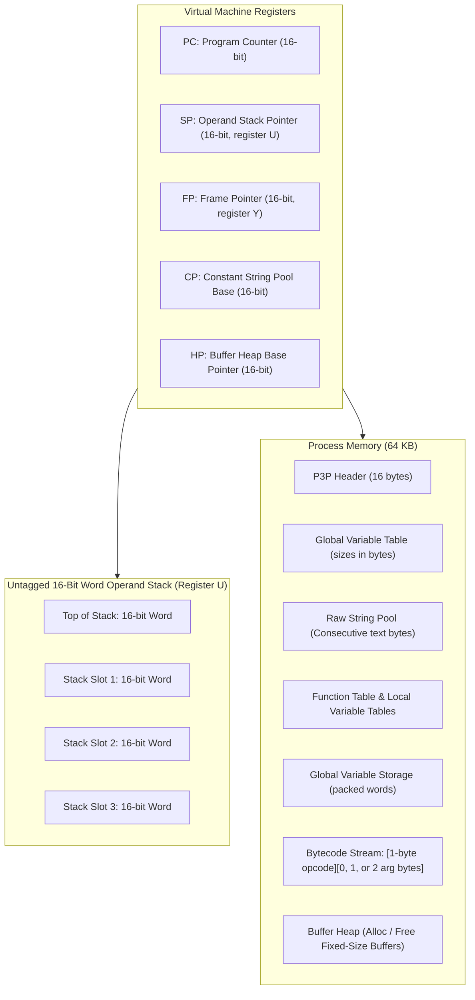

# Par3 Language & Virtual Machine Specification

**Version:** 0.4
**Date:** October 2026
**Document:** `par3-runtime/design.md`
**Source Language:** Par3 (`*.par3`)
**Intermediate Target:** Par3 assembly language (`*.p3a`)
**Bytecode Target:** Par3 P-Codes (`*.p3p`)
**Virtual Machine Interpreter:** `par3vm` / `npcode`

---

## 1. Introduction & Design Philosophy

The **Par3** language and **Par3Code** Virtual Machine provide a compact, deterministic, and easily portable programming environment tailored for 8-bit and 16-bit architectures—specifically Motorola 6809 and Hitachi 6309 systems running NitrOS-9 Level 1 and Level 2, as well as embedded microcontrollers (such as the RP2350 on the TFR911h board) and Unix host systems.

The primary motivating workload is the native self-generation and source transformation pipeline for NitrOS-9 (e.g. [`recipes/deep65280/selfgen_preprocess.py`](file:///home/strick/modoc/coco-shelf/nitros9/recipes/deep65280/selfgen_preprocess.py)), which translates modern assembly source into native assembler dialects.

### 1.1 Core Directives: Space-First, Go-Like Typing, Slices, and Unhashed Dicts

To run comfortably in memory-constrained environments (such as a 64 KB 6809 address space with NitrOS-9 system overhead), the architecture **optimizes for minimum space instead of fastest speed**:

1. **Strongly-Typed (A Go-Like Machine, Not Python)**:
   - Par3 is a **statically, strongly-typed language**. Every variable, function parameter, return value, struct field, and collection element type is checked and known at compile time.
   - The VM does **not** perform dynamic type checking or inspect runtime type tags.
   - A 16-bit word on the operand stack represents an `int16_t`, a `uint16_t`, or a 16-bit memory address.
   - There are **no 32-bit types**. In the rare case that 32-bit functionality is needed (e.g. for filesystem size or sector APIs), the program codes it explicitly using two `uint16_t` variables in the host language.

2. **Unified 3-Word Slices (`{ pointer, capacity, length }`)**:
   - Following Go's design, dynamically sized data structures—specifically **`string`**, **`List[T]`** (like Go's `[]T`), and **`Dict[string, T]`** (like Go's `map[string]T`)—are all represented by uniform **3-word slices** (6 bytes total):
     - **Word 0 (`pointer`)**: 16-bit memory address pointing to the element buffer (or constant string pool).
     - **Word 1 (`capacity`)**: 16-bit allocated capacity (in bytes for strings, or in 16-bit elements for lists/dicts).
     - **Word 2 (`length`)**: 16-bit active length (in bytes for strings, or in 16-bit elements for lists/dicts).
   - Sub-slicing (`s[start:end]`) produces a new 3-word slice pointing directly into the existing buffer with adjusted `pointer`, `capacity`, and `length` in $O(1)$ time with **zero memory allocation**.

3. **Fixed-Size Buffers (16-Bit Addresses)**:
   - Fixed-size memory buffers can be dynamically allocated (`BUF_ALLOC`) and freed (`BUF_FREE`).
   - A buffer is represented simply by its **16-bit integer address** (`uint16_t`).
   - Slices point into these fixed-size buffers. When a slice outgrows its capacity during an `append` or dict insertion, the runtime allocates a larger fixed-size buffer, copies existing elements, frees the old buffer, and updates the slice.

4. **Unhashed, Alternating Linear Dicts**:
   - `Dict[string, T]` is implemented simply as a list with an **even number of 16-bit elements**, alternating between a string pointer (`const char*`) and a 16-bit value:
     `[key_ptr_0, val_0, key_ptr_1, val_1, key_ptr_2, val_2, ...]`
   - Dicts are **not hashed or optimized**. Lookups perform a simple linear scan over key pointers using string equality.
   - **Space Rationale**: For compiler symbol tables and preprocessor translation tables (typically dozens or hundreds of symbols), a linear scan requires only ~30 bytes of 6809 assembly code and zero auxiliary RAM overhead (no hash tables, no bucket arrays, no collision link pointers). This maximizes available user RAM.

5. **Variable-Table-Driven Load and Store**:
   - To keep bytecode dense and avoid duplicating load/store opcodes for every data type and width, `LOAD_LOCAL`, `STORE_LOCAL`, `LOAD_GLOBAL`, and `STORE_GLOBAL` consult the **Variable Tables** in the executable metadata to determine how many bytes (words) are in their values.
   - A scalar integer/boolean variable occupies 2 bytes (1 word); a slice variable occupies 6 bytes (3 words).
   - Executing `LOAD_LOCAL 0` checks the variable table for local 0: if it is a slice, it pushes all 3 words onto the stack; if it is a scalar, it pushes 1 word.

6. **Simplified Nil: No Nil Object**:
   - A nil pointer or buffer address is `$0000` (`NULL`).
   - A nil slice is simply `{ pointer: $0000, capacity: $0000, length: $0000 }` (three zero words).
   - There is no heap-allocated nil object.

7. **Simplified Booleans & The Zero-Test `if`**:
   - For Booleans: `$0000` is `false`. Anything else (`!= $0000`) is `true`.
   - The canonical Boolean constant `true` is `$0001`.
   - The `if` construct (and `while`, `JUMP_IF_FALSE`, `JUMP_IF_TRUE`) simply tests whether a 16-bit word is `$0000` (false / nil / zero) or non-zero (true / valid pointer / non-zero integer).

8. **Strict 1-Byte Opcodes with 0, 1, or 2 Argument Bytes**:
   - Every opcode is exactly 1 byte (`0x00` .. `0xFF`).
   - The opcode defines whether it takes 0, 1, or 2 argument bytes.
   - There are no argument type tags in the bytecode stream.

---

## 2. The Par3 Source Language (`*.par3`)

Par3 features a Go-inspired, statically typed syntax with explicit error handling and built-in text processing primitives.

### 2.1 Types
- **`int` / `int16`**: 16-bit signed integer ($-32,768 \dots +32,767$). 1 word (2 bytes).
- **`uint` / `uint16`**: 16-bit unsigned integer ($0 \dots 65,535$). 1 word (2 bytes).
- **`bool`**: Boolean value (`false` = `$0000`, `true` = `$0001`). 1 word (2 bytes).
- **`buf`**: 16-bit integer address pointing to a fixed-size memory buffer. 1 word (2 bytes).
- **`str` / `string`**: 3-word slice `{ pointer, capacity, length }` pointing to a sequence of bytes. 3 words (6 bytes).
- **`List[T]`**: 3-word slice `{ pointer, capacity, length }` of 16-bit elements. 3 words (6 bytes).
- **`Dict[str, T]`**: 3-word slice `{ pointer, capacity, length }` of alternating `(str_ptr, val_16)` pairs. 3 words (6 bytes).
- **`struct Name { ... }`**: Named record with fixed-offset fields.
- **`file`**: System I/O file path descriptor (0..255). 1 word (2 bytes).

### 2.2 Slices & Fixed-Size Buffers

```python
# Fixed buffer allocation
let b: buf = alloc(128)      # Allocates 128 bytes from buffer heap
free(b)                      # Releases buffer back to heap

# Slices
let s: str = "hello world"   # 3-word slice: { ptr: &strpool, cap: 11, len: 11 }
let sub: str = s[0:5]        # 3-word slice: { ptr: s.ptr + 0, cap: 11, len: 5 } (no copy!)

# Lists
let items: List[int] = list_new(16)   # Allocates 32-byte buffer (16 words); len=0, cap=16
items.append(42)                      # Appends word; len=1

# Dicts (linear alternating list)
let symbols: Dict[str, int] = dict_new(8)  # Allocates buffer for 16 words (8 pairs)
symbols["DP"] = 0x2000                     # Linear scan; appends ("DP", 0x2000); len=2
let val: int, ok: bool = symbols.get("DP") # Linear scan; returns (0x2000, true)
```

### 2.3 Control Flow & Truthiness
- **Uniform Zero-Test**:
  In Par3, the `if` and `while` statements test whether a 16-bit word evaluates to non-zero:
  ```python
  if ptr:          # true if ptr != nil ($0000)
      ...
  if ok:           # true if ok != false ($0000)
      ...
  if len(s):       # true if length != 0 ($0000)
      ...
  ```
- **Error Handling by Convention (No Exceptions)**:
  Functions that can fail return an explicit status Boolean:
  ```python
  let val: int, ok: bool = parse_int(count, 0)
  if ok:
      # use numeric count
  else:
      # handle symbolic count
  ```

---

## 3. Par3Code Virtual Machine Architecture

Par3Code is a **stack-based virtual machine** with an untagged 16-bit operand stack and variable-table-driven storage.



### 3.1 Untagged 16-Bit Word Operand Stack
Every slot on the operand stack is a uniform **16-bit word (`uint16_t`)**.
- A scalar value (`int`, `bool`, `buf`) occupies **1 stack slot**.
- A slice (`str`, `List`, `Dict`) occupies **3 consecutive stack slots**:
  ```text
  [Top of Stack]  length   (16-bit)
                  capacity (16-bit)
  [Base of Slice] pointer  (16-bit)
  ```
- On a 6809 CPU, the user stack pointer `U` is used directly as `SP`:
  - Push 16-bit word in `D`: `pshu d` (2 bytes, 5 cycles).
  - Pop 16-bit word into `D`: `pulu d` (2 bytes, 5 cycles).

### 3.2 Fixed-Size Buffer Allocator
- The runtime manages a contiguous buffer heap above the bytecode section.
- Fixed-size buffers are allocated using a minimal **first-fit free-list allocator**:
  - Each free block stores a 16-bit size and a 16-bit pointer to the next free block.
  - Allocated blocks are prefixed with a 2-byte size header.
  - `BUF_ALLOC`: pops requested size in bytes, aligns to 2 bytes, finds or splits a free block, returns pointer to the user data area (`$0000` if out of memory).
  - `BUF_FREE`: pops 16-bit address, prepends to free list, and coalesces adjacent blocks.

### 3.3 Variable-Table-Driven Load and Store
To minimize bytecode size and keep the instruction set simple, `LOAD_LOCAL`, `STORE_LOCAL`, `LOAD_GLOBAL`, and `STORE_GLOBAL` do not hardcode variable widths into opcode names. Instead, they consult the variable table:
- **Local Variable Table**: Each function has an array of 1-byte sizes indicating the size in bytes of each parameter and local variable (e.g. 2 for scalar, 6 for slice).
- When `LOAD_LOCAL <slot>` executes:
  1. The VM reads `size = CurrentFunc->LocalVarTable[slot]`.
  2. The VM computes the frame offset for `<slot>` (sum of sizes of preceding slots).
  3. The VM pushes `size / 2` words from `FP + offset` onto the operand stack `U`.
- When `STORE_LOCAL <slot>` executes:
  1. The VM reads `size = CurrentFunc->LocalVarTable[slot]`.
  2. The VM pops `size / 2` words from the operand stack `U` into `FP + offset`.
- Fast zero-byte opcodes `LOAD_LOCAL_0` .. `LOAD_LOCAL_3` and `STORE_LOCAL_0` .. `STORE_LOCAL_3` perform the exact same lookup for slots 0..3 without taking an argument byte.

### 3.4 Unhashed Alternating Dict Representation
A `Dict[str, T]` is represented by the 3-word slice `{ pointer, capacity, length }`:
- `pointer` points to an allocated buffer of 16-bit words.
- Elements alternate:
  - Even index $2i$: string pointer (`const char*`) to null-terminated key in String Pool or heap buffer.
  - Odd index $2i+1$: 16-bit value of type `T`.
- `length` is always even ($2 \times \text{number of entries}$).
- `capacity` is the total number of words in the buffer.
- **Lookup (`DICT_GET`)**: Scans even indices $0, 2, 4, \dots, \text{length}-2$. Compares strings using `strcmp`. If found, pushes value at $2i+1$ and `true` (`$0001`). If not found, pushes `$0000` and `false` (`$0000`).

---

## 4. Binary File Format (`*.p3p`)

Par3Code binary files (`*.p3p`) are compiled bytecode executables. Multi-byte integers are stored in **Big-Endian** format (matching 6809/6309 native order).

### 4.1 File Layout

```text
+-----------------------------------------------------------+
| 1. Header (16 bytes)                                      |
+-----------------------------------------------------------+
| 2. Global Variable Table (1 byte per global: size in bytes)|
+-----------------------------------------------------------+
| 3. String Pool (Raw bytes, length-prefixed, null-term)    |
+-----------------------------------------------------------+
| 4. Function Table & Local Variable Tables                 |
+-----------------------------------------------------------+
| 5. Bytecode Section: Pure stream of opcodes and args       |
+-----------------------------------------------------------+
```

### 4.2 Header Specification (16 Bytes)

| Offset | Size | Field Name | Description |
| :--- | :--- | :--- | :--- |
| `0x00` | 4 | `Magic` | 4-byte magic number: `0x50 0x33 0x50 0x01` (`"P3P\x01"`). (Legacy `"NPC\x01"` / `0x4E 0x50 0x43 0x01` also accepted). |
| `0x04` | 1 | `FormatVer` | Format version (currently `1`) |
| `0x05` | 1 | `Flags` | Execution flags (Bit 0 = 6309 native, Bit 1 = MMU banked) |
| `0x06` | 2 | `StringPoolSize` | Total byte size of the raw String Pool section |
| `0x08` | 2 | `GlobalsCount`| Number of global variables in the Global Var Table |
| `0x0A` | 2 | `FuncCount` | Number of functions in the Function Table |
| `0x0C` | 2 | `EntryFunc` | Function index of the entry point (`main`) |
| `0x0E` | 2 | `CodeSize` | Total byte size of the Bytecode Section |

### 4.3 Global Variable Table
Following the header is an array of `GlobalsCount` bytes:
- Byte $i$: size in bytes of global variable $i$ (e.g. `0x02` for scalar, `0x06` for 3-word slice).
- At startup, the VM allocates $\sum \text{sizes}$ bytes for global storage and builds an offset table.

### 4.4 Function Table & Local Variable Tables
Each function entry in the Function Table is 10 bytes:
- `ArgCount` (1 byte): Number of parameter variables.
- `LocalCount` (1 byte): Number of local variables.
- `FrameSize` (2 bytes): Total frame size in bytes ($\sum \text{local sizes}$).
- `CodeOffset` (2 bytes): Bytecode start offset relative to Bytecode Section.
- `CodeSize` (2 bytes): Total byte size of function bytecode.
- `VarTableOffset` (2 bytes): Offset into the Local Variable Tables section.

At `VarTableOffset`, an array of `(ArgCount + LocalCount)` bytes defines the byte size of each parameter and local variable (e.g. `0x02` for scalar, `0x06` for slice).

---

## 5. Instruction Set Architecture (ISA)

Every instruction starts with a **1-byte opcode**. The opcode explicitly defines whether it takes **0, 1, or 2 argument bytes**. There are no dynamic type tags in the bytecode stream.

### 5.1 Immediate Argument Encoding Formats
- **None (0 bytes)**: Opcode is completely standalone.
- **`<imm8>` (1 byte)**: 8-bit immediate value (slot index, small integer, or width).
- **`<imm16>` (2 bytes)**: 16-bit big-endian immediate value (string offset, capacity, function index).
- **`<rel16>` (2 bytes)**: 16-bit big-endian signed relative branch offset.

---

### 5.2 Complete Opcode Table

#### Group 1: Stack & Literals (`0x00 .. 0x1F`)

| Opcode | Mnemonic | Arg Bytes | Operand Format | Stack Effect | Description |
| :--- | :--- | :---: | :--- | :--- | :--- |
| `0x00` | `NOP` | **0** | None | `[] -> []` | No operation. |
| `0x01` | `PUSH_NIL` | **0** | None | `[] -> [$0000]` | Push scalar `nil` / zero word (`$0000`). |
| `0x02` | `PUSH_NIL_SLICE`| **0**| None | `[] -> [$0000, $0000, $0000]` | Push nil slice `{ ptr: 0, cap: 0, len: 0 }`. |
| `0x03` | `PUSH_TRUE` | **0** | None | `[] -> [$0001]` | Push canonical Boolean `true` (`$0001`). |
| `0x04` | `PUSH_FALSE` | **0** | None | `[] -> [$0000]` | Push Boolean `false` (`$0000`). |
| `0x05` | `PUSH_0` | **0** | None | `[] -> [$0000]` | Fast push of integer 0 (`$0000`). |
| `0x06` | `PUSH_1` | **0** | None | `[] -> [$0001]` | Fast push of integer 1 (`$0001`). |
| `0x07` | `PUSH_NEG1` | **0** | None | `[] -> [$FFFF]` | Fast push of integer -1 (`$FFFF`). |
| `0x08` | `PUSH_I8` | **1** | `<imm8>` | `[] -> [val]` | Push sign-extended 8-bit integer (-128..127). |
| `0x09` | `PUSH_U8` | **1** | `<imm8>` | `[] -> [val]` | Push zero-extended 8-bit unsigned integer (0..255). |
| `0x0A` | `PUSH_I16` | **2** | `<imm16>` | `[] -> [val]` | Push 16-bit big-endian integer. |
| `0x0B` | `PUSH_STR` | **2** | `<imm16>` | `[] -> [ptr, cap, len]` | Push 3-word string slice referencing String Pool at offset `imm16`. |
| `0x0C` | `POP` | **0** | None | `[a] -> []` | Discard top 16-bit word from stack. |
| `0x0D` | `POP_SLICE` | **0** | None | `[ptr, cap, len] -> []` | Discard top 3-word slice from stack. |
| `0x0E` | `DUP` | **0** | None | `[a] -> [a, a]` | Duplicate top 16-bit word. |
| `0x0F` | `SWAP` | **0** | None | `[a, b] -> [b, a]`| Swap top two 16-bit words. |

#### Group 2: Variables & Buffers (`0x20 .. 0x3F`)

*`LOAD_LOCAL`, `STORE_LOCAL`, `LOAD_GLOBAL`, `STORE_GLOBAL` look up the variable size (1 word or 3 words) in the variable table.*

| Opcode | Mnemonic | Arg Bytes | Operand Format | Stack Effect | Description |
| :--- | :--- | :---: | :--- | :--- | :--- |
| `0x20` | `LOAD_LOCAL_0` | **0** | None | `[] -> [val...]` | Load variable from local slot 0 (size from VarTable). |
| `0x21` | `LOAD_LOCAL_1` | **0** | None | `[] -> [val...]` | Load variable from local slot 1 (size from VarTable). |
| `0x22` | `LOAD_LOCAL_2` | **0** | None | `[] -> [val...]` | Load variable from local slot 2 (size from VarTable). |
| `0x23` | `LOAD_LOCAL_3` | **0** | None | `[] -> [val...]` | Load variable from local slot 3 (size from VarTable). |
| `0x24` | `STORE_LOCAL_0`| **0** | None | `[val...] -> []` | Store variable into local slot 0 (size from VarTable). |
| `0x25` | `STORE_LOCAL_1`| **0** | None | `[val...] -> []` | Store variable into local slot 1 (size from VarTable). |
| `0x26` | `STORE_LOCAL_2`| **0** | None | `[val...] -> []` | Store variable into local slot 2 (size from VarTable). |
| `0x27` | `STORE_LOCAL_3`| **0** | None | `[val...] -> []` | Store variable into local slot 3 (size from VarTable). |
| `0x28` | `LOAD_LOCAL` | **1** | `<imm8>` | `[] -> [val...]` | Load variable from local slot `imm8` (size from VarTable). |
| `0x29` | `STORE_LOCAL`| **1** | `<imm8>` | `[val...] -> []` | Store variable into local slot `imm8` (size from VarTable). |
| `0x2A` | `LOAD_GLOBAL` | **2** | `<imm16>` | `[] -> [val...]` | Load variable from global slot `imm16` (size from VarTable). |
| `0x2B` | `STORE_GLOBAL`| **2** | `<imm16>` | `[val...] -> []` | Store variable into global slot `imm16` (size from VarTable). |
| `0x2C` | `BUF_ALLOC` | **0** | None | `[size] -> [buf_addr]` | Allocate fixed-size buffer of `size` bytes from heap. |
| `0x2D` | `BUF_FREE` | **0** | None | `[buf_addr] -> []` | Free fixed-size buffer back to heap. |
| `0x2E` | `LOAD_FIELD` | **1** | `<imm8>` | `[obj_ptr] -> [val]`| Load 16-bit word from struct field at byte offset `imm8`. |
| `0x2F` | `STORE_FIELD`| **1** | `<imm8>` | `[obj_ptr, val] -> []`| Store 16-bit word into struct field at offset `imm8`. |

#### Group 3: Arithmetic, Logic & Comparisons (`0x40 .. 0x5F`)

*All standard arithmetic and comparison opcodes operate on 16-bit words and take 0 argument bytes.*

| Opcode | Mnemonic | Arg Bytes | Operand Format | Stack Effect | Description |
| :--- | :--- | :---: | :--- | :--- | :--- |
| `0x40` | `ADD` | **0** | None | `[a, b] -> [a + b]` | 16-bit integer addition. |
| `0x41` | `SUB` | **0** | None | `[a, b] -> [a - b]` | 16-bit integer subtraction. |
| `0x42` | `MUL` | **0** | None | `[a, b] -> [a * b]` | 16-bit signed integer multiplication. |
| `0x43` | `DIV` | **0** | None | `[a, b] -> [a / b]` | 16-bit signed integer division. |
| `0x44` | `MOD` | **0** | None | `[a, b] -> [a % b]` | 16-bit integer modulo. |
| `0x45` | `NEG` | **0** | None | `[a] -> [-a]` | 16-bit integer negation. |
| `0x46` | `BIT_AND` | **0** | None | `[a, b] -> [a & b]` | 16-bit bitwise AND. |
| `0x47` | `BIT_OR` | **0** | None | `[a, b] -> [a \| b]` | 16-bit bitwise OR. |
| `0x48` | `BIT_XOR` | **0** | None | `[a, b] -> [a ^ b]` | 16-bit bitwise XOR. |
| `0x49` | `BIT_NOT` | **0** | None | `[a] -> [~a]` | 16-bit bitwise NOT. |
| `0x4A` | `SHL` | **0** | None | `[a, b] -> [a << b]` | 16-bit logical shift left. |
| `0x4B` | `SHR` | **0** | None | `[a, b] -> [a >> b]` | 16-bit arithmetic shift right. |
| `0x4C` | `CMP_EQ` | **0** | None | `[a, b] -> [bool]` | Equal (`==`). Pushes `$0001` (true) or `$0000` (false). |
| `0x4D` | `CMP_NE` | **0** | None | `[a, b] -> [bool]` | Not equal (`!=`). Pushes `$0001` or `$0000`. |
| `0x4E` | `CMP_LT` | **0** | None | `[a, b] -> [bool]` | Signed less than (`<`). |
| `0x4F` | `CMP_LE` | **0** | None | `[a, b] -> [bool]` | Signed less than or equal (`<=`). |
| `0x50` | `CMP_GT` | **0** | None | `[a, b] -> [bool]` | Signed greater than (`>`). |
| `0x51` | `CMP_GE` | **0** | None | `[a, b] -> [bool]` | Signed greater than or equal (`>=`). |
| `0x52` | `NOT` | **0** | None | `[a] -> [bool]` | Logical NOT: pushes `$0001` if `a == $0000`, else `$0000`. |
| `0x53` | `MIN` | **0** | None | `[a, b] -> [min(a,b)]`| Signed integer minimum. |
| `0x54` | `MAX` | **0** | None | `[a, b] -> [max(a,b)]`| Signed integer maximum. |
| `0x55` | `PARSE_INT`| **0** | None | `[str_slice, radix] -> [val, ok]`| Parse integer from string slice. Pushes parsed value and success Boolean. |

#### Group 4: Control Flow & Function Calls (`0x60 .. 0x6F`)

| Opcode | Mnemonic | Arg Bytes | Operand Format | Stack Effect | Description |
| :--- | :--- | :---: | :--- | :--- | :--- |
| `0x60` | `JUMP` | **2** | `<rel16>` | `[] -> []` | Relative unconditional branch. |
| `0x61` | `JUMP_IF_TRUE`| **2** | `<rel16>` | `[cond] -> []` | Pop 16-bit word; branch if `cond != $0000`. |
| `0x62` | `JUMP_IF_FALSE`| **2**| `<rel16>` | `[cond] -> []` | Pop 16-bit word; branch if `cond == $0000`. |
| `0x63` | `CALL` | **2** | `<imm16>` | `[args...] -> [res...]` | Call function index `imm16` (signature in Function Table). |
| `0x64` | `RET` | **0** | None | `[res] -> [...]` | Return 16-bit scalar word to caller. |
| `0x65` | `RET_SLICE` | **0** | None | `[ptr, cap, len] -> [...]` | Return 3-word slice to caller. |
| `0x66` | `RET_VOID` | **0** | None | `[] -> [...]` | Return `nil` (`$0000`) to caller. |
| `0x67` | `HALT` | **0** | None | `[] -> []` | Terminate VM execution cleanly (exit 0). |

#### Group 5: Slices & Strings (`0x70 .. 0x8F`)

*Slices are uniform `{ pointer, capacity, length }` structures. Sub-slicing creates views with zero allocation.*

| Opcode | Mnemonic | Arg Bytes | Operand Format | Stack Effect | Description |
| :--- | :--- | :---: | :--- | :--- | :--- |
| `0x70` | `SLICE_NEW` | **0** | None | `[ptr, cap, len] -> [slice]`| Construct 3-word slice from raw components. |
| `0x71` | `SLICE_LEN` | **0** | None | `[slice] -> [len]` | Extract 16-bit length from slice. |
| `0x72` | `SLICE_CAP` | **0** | None | `[slice] -> [cap]` | Extract 16-bit capacity from slice. |
| `0x73` | `SLICE_SUB` | **0** | None | `[slice, start, end] -> [view]`| Return sub-slice view (`ptr+start`, `cap-start`, `end-start`). 0 copy! |
| `0x74` | `SLICE_GET_BYTE`| **0**| None | `[slice, idx] -> [char]` | Fetch byte at `idx` in string slice (or -1 if out of bounds). |
| `0x75` | `SLICE_GET_WORD`| **0**| None | `[slice, idx] -> [val]` | Fetch 16-bit word at `idx` in word slice. |
| `0x76` | `SLICE_SET_WORD`| **0**| None | `[slice, idx, val] -> []` | Store 16-bit word at `idx` in word slice. |
| `0x77` | `STR_CMP` | **0** | None | `[slice_a, slice_b] -> [res]`| Lexicographical comparison (-1, 0, +1). |
| `0x78` | `STR_STARTSWITH`| **0**| None | `[str, pfx] -> [bool]` | Prefix check: pushes `$0001` or `$0000`. |
| `0x79` | `STR_ENDSWITH`| **0** | None | `[str, sfx] -> [bool]` | Suffix check: pushes `$0001` or `$0000`. |
| `0x7A` | `STR_FIND` | **0** | None | `[str, sub, start] -> [idx]`| Linear search; returns character index or -1. |
| `0x7B` | `STR_LSTRIP` | **0** | None | `[str, chars] -> [view]`| Strip leading characters (`chars` nil for whitespace). Returns view. |
| `0x7C` | `STR_RSTRIP` | **0** | None | `[str, chars] -> [view]`| Strip trailing characters. Returns view. |
| `0x7D` | `STR_STRIP` | **0** | None | `[str, chars] -> [view]`| Strip leading and trailing characters. Returns view. |
| `0x7E` | `STR_SPLITLINES`| **0**| None | `[str] -> [list_slice]` | Splits text by `\n` into list of string slice views. |
| `0x7F` | `STR_REPLACE_IDENT`| **0**| None | `[str, old, new] -> [res]`| **Word-Boundary Replacer**: Replaces `old` with `new` when neither preceded nor followed by `[A-Za-z0-9_.]`. |

#### Group 6: Collections (Dicts as Linear Alternating Lists) (`0x90 .. 0xAF`)

*`Dict[str, T]` is implemented as an alternating `(key_ptr, val_16)` list. It is not hashed or optimized (simple linear scan).*

| Opcode | Mnemonic | Arg Bytes | Operand Format | Stack Effect | Description |
| :--- | :--- | :---: | :--- | :--- | :--- |
| `0x90` | `DICT_NEW` | **2** | `<imm16>` | `[] -> [dict_slice]` | Allocate buffer for `imm16` entries (`2 * imm16` words); returns `{ ptr, cap, len=0 }`. |
| `0x91` | `DICT_GET` | **0** | None | `[dict_slice, key_str] -> [val, ok]`| Linear scan over alternating keys. Pushes 16-bit value and `$0001` (true), or `$0000` and `$0000` (false). |
| `0x92` | `DICT_SET` | **0** | None | `[dict_slice, key_str, val] -> [new_dict]`| Linear scan: updates value if key exists; if not, appends `key_ptr` and `val` (growing buffer if needed). |
| `0x93` | `DICT_HAS` | **0** | None | `[dict_slice, key_str] -> [bool]`| Linear scan key membership test (`$0001`/`$0000`). |
| `0x94` | `DICT_KEYS` | **0** | None | `[dict_slice] -> [list_slice]` | Returns list slice containing all string key pointers. |
| `0x95` | `DICT_LEN` | **0** | None | `[dict_slice] -> [count]` | Returns entry count (`length / 2`). |
| `0x96` | `LIST_NEW` | **2** | `<imm16>` | `[] -> [list_slice]` | Allocate buffer for `imm16` 16-bit words; returns `{ ptr, cap, len=0 }`. |
| `0x97` | `LIST_APPEND`| **0** | None | `[list_slice, val] -> [new_list]`| Append 16-bit word to list (grows buffer via `alloc`/`free` if full). |
| `0x98` | `LIST_POP` | **0** | None | `[list_slice] -> [new_list, val]`| Pop and return last 16-bit element. |
| `0x99` | `LIST_SORT_BY_LEN`| **0**| None | `[list_slice, reverse] -> []`| Sorts list of string slices in-place by length. |

#### Group 7: Regular Expressions (`0xB0 .. 0xBF`)

| Opcode | Mnemonic | Arg Bytes | Operand Format | Stack Effect | Description |
| :--- | :--- | :---: | :--- | :--- | :--- |
| `0xB0` | `REG_MATCH` | **2** | `<imm16>` | `[str_slice] -> [match_ptr, ok]`| Anchored match against regex index `imm16`. |
| `0xB1` | `REG_SEARCH`| **2** | `<imm16>` | `[str_slice] -> [match_ptr, ok]`| Unanchored search against regex index `imm16`. |
| `0xB2` | `REG_GROUP` | **0** | None | `[match_ptr, grp_idx] -> [slice]`| Extract captured group string slice view. |
| `0xB3` | `REG_GROUP_END`| **0**| None | `[match_ptr, grp_idx] -> [pos]`| Return ending character index of capture. |

#### Group 8: File System & OS System Calls (`0xC0 .. 0xCF`)

| Opcode | Mnemonic | Arg Bytes | Operand Format | Stack Effect | Description |
| :--- | :--- | :---: | :--- | :--- | :--- |
| `0xC0` | `FILE_OPEN_READ`| **0**| None | `[path_slice] -> [handle, ok]`| Open file for reading (`os9 I$Open`). |
| `0xC1` | `FILE_OPEN_WRITE`| **0**| None | `[path_slice] -> [handle, ok]`| Create/truncate file for writing (`os9 I$Create`). |
| `0xC2` | `FILE_READLINE`| **0**| None | `[handle] -> [line_slice, eof]`| Read line into buffer; returns string slice view. |
| `0xC3` | `FILE_WRITE` | **0** | None | `[handle, str_slice] -> [ok]` | Write string slice buffer via `os9 I$Write`. |
| `0xC4` | `FILE_CLOSE` | **0** | None | `[handle] -> []` | Close path via `os9 I$Close`. |
| `0xC5` | `OS_ISFILE` | **0** | None | `[path_slice] -> [bool]` | Test file existence. |
| `0xC6` | `OS_MAKEDIRS` | **0** | None | `[path_slice] -> [ok]` | Recursively create directory path (`os9 I$MakDir`). |
| `0xC7` | `SYS_ARGS` | **0** | None | `[] -> [list_slice]` | Push command line argument string slice list. |
| `0xC8` | `SYS_EXIT` | **0** | None | `[code] -> []` | Exit process with status code (`os9 F$Exit`). |
| `0xC9` | `IO_PRINT` | **0** | None | `[str_slice] -> []` | Print string slice followed by newline (`I$WriteLn`). |

---

## 6. Space-Optimized 6809 / 6309 Interpreter Implementation

Because the engine optimizes for **minimum space**, the interpreter routines are kept small, avoiding complex hash algorithms or multi-page dispatch tables.

### 6.1 Register Allocation in 6809 Assembly
- **`X`**: Program Counter (`PC`) pointing to the current bytecode instruction.
- **`U`**: Operand Stack Pointer (`SP`), growing downward.
- **`Y`**: Frame Pointer (`FP`) pointing to the base of local variables.
- **`S`**: Hardware Call Stack (storing return addresses and saved `FP`s).
- **`D`**: Work accumulator (`A` and `B`).

### 6.2 The Core Dispatch Loop (Compact)

```assembly
; ====================================================================
; NextInst: Fetch 1-byte opcode and dispatch via jump table
; Minimal code footprint: 8 bytes of assembly
; ====================================================================
NextInst:
            ldb       ,x+                 ; Fetch 1-byte opcode, advance PC
            clra
            aslb                          ; Opcode * 2
            rola
            ldu       #OpcodeTable        ; Base of handler address table
            jmp       [d,u]               ; Indirect jump to opcode handler
```

### 6.3 Variable-Table-Driven Local Load and Store

The variable table stores the byte size (2 or 6) for each variable slot. A tiny helper routine handles both scalars and slices:

```assembly
; ====================================================================
; Op_LOAD_LOCAL: Consult variable table and copy words onto stack
; ====================================================================
Op_LOAD_LOCAL_0:
            clrb                          ; Slot 0
            bra       Do_LOAD_LOCAL
Op_LOAD_LOCAL_1:
            ldb       #1                  ; Slot 1
            bra       Do_LOAD_LOCAL
Op_LOAD_LOCAL:
            ldb       ,x+                 ; Fetch slot index from bytecode
Do_LOAD_LOCAL:
            ; B = slot index. Look up frame offset and size in VarTable.
            ; Frame offset is precomputed or accumulated.
            jsr       GetVarOffsetAndSize ; Returns X=FP+offset, B=size in bytes
@copy_loop:
            ldd       ,x++                ; Read word from local frame
            pshu      d                   ; Push onto operand stack
            subb      #2
            bne       @copy_loop
            bra       NextInst

; ====================================================================
; Op_STORE_LOCAL: Pop words from stack into local frame
; ====================================================================
Op_STORE_LOCAL_0:
            clrb
            bra       Do_STORE_LOCAL
Op_STORE_LOCAL:
            ldb       ,x+
Do_STORE_LOCAL:
            jsr       GetVarOffsetAndSize ; X=FP+offset, B=size in bytes
            leax      b,x                 ; Point to end of local storage
@store_loop:
            pulu      d                   ; Pop word from stack
            std       ,--x                ; Store in reverse order
            subb      #2
            bne       @store_loop
            bra       NextInst
```

### 6.4 Unhashed Linear Scan Dict Lookup (`DICT_GET`)

A complete hash table implementation in 6809 assembly requires 300–500 bytes of code and multiple auxiliary tables. The unhashed linear scan below requires **only ~32 bytes of code**:

```assembly
; ====================================================================
; Op_DICT_GET: Linear scan over alternating [key_ptr, val] list
; Stack on entry: [dict_slice (3 words), key_slice (3 words)]
; ====================================================================
Op_DICT_GET:
            ; Pop search key slice: kptr, kcap, klen into temp storage
            pulu      d                   ; klen
            std       TempKeyLen
            pulu      d                   ; kcap
            pulu      d                   ; kptr
            std       TempKeyPtr
            ; Pop dict slice: dptr, dcap, dlen
            pulu      d                   ; dlen (number of 16-bit words)
            std       TempDictLen
            pulu      d                   ; dcap
            pulu      y                   ; dptr -> Y points to [key0, val0, key1, val1, ...]

            clra
            clrb                          ; Word index = 0
@scan_loop:
            cmpd      TempDictLen         ; Reached end of dictionary entries?
            bhs       @not_found

            ldx       d,y                 ; X = key_ptr at index d
            pshs      d,y
            jsr       StrCmp              ; Compare string at X with TempKeyPtr
            puls      d,y
            beq       @found              ; Strings match!

            addd      #2                  ; Advance by 2 words (skip key and value)
            bra       @scan_loop

@found:
            addd      #1                  ; Index of value
            asld                          ; Byte offset
            ldd       d,y                 ; Load value
            pshu      d                   ; Push value
            ldd       #$0001              ; Push ok = true ($0001)
            pshu      d
            bra       NextInst

@not_found:
            clra
            clrb
            pshu      d                   ; Push value = $0000
            pshu      d                   ; Push ok = false ($0000)
            bra       NextInst
```

---

## 7. Concrete Example: Compiling `selfgen_preprocess` to Par3Code

Here is how lines 53–63 of `selfgen_preprocess.py` look in Par3 source code and how they assemble into space-optimized Par3Code using 3-word slices:

### 7.1 Par3 Source Code
```python
fn split_asm_line(line: str) -> (str, str):
    # line is a 3-word slice { ptr, cap, len }
    let s: str = line.rstrip("\r\n")       # returns slice view (0 alloc)
    let s_strip: str = s.lstrip("")        # returns slice view (0 alloc)
    if s == "" or s_strip.startswith("*") or s_strip.startswith(";"):
        return ("", line)
    # ...
    return (code_part, comment_part)
```

### 7.2 Variable Table for `split_asm_line`

| Slot | Name | Type | Size (Bytes) | Frame Offset |
| :---: | :--- | :--- | :---: | :---: |
| `0` | `line` (param) | `str` (slice) | **6** | `0` |
| `1` | `s` (local) | `str` (slice) | **6** | `6` |
| `2` | `s_strip` (local) | `str` (slice) | **6** | `12` |
| `3` | `code_part` (local)| `str` (slice) | **6** | `18` |
| `4` | `comment_part` | `str` (slice) | **6** | `24` |

*Total local frame size: 30 bytes.*

### 7.3 Bytecode Disassembly with 3-Word Slices

```text
Offset   Opcode  ArgBytes  Operands       Assembly Mnemonic          Description
-------------------------------------------------------------------------------------------------
; let s: str = line.rstrip("\r\n")
0x0020   0x20    0         None           LOAD_LOCAL_0               Push line slice (3 words, FP+0)
0x0021   0x0B    2         0x0012         PUSH_STR 0x0012            Push "\r\n" slice from String Pool
0x0024   0x7C    0         None           STR_RSTRIP                 Returns trimmed slice view
0x0025   0x25    0         None           STORE_LOCAL_1              Store into s (3 words, FP+6)

; let s_strip: str = s.lstrip("")
0x0026   0x21    0         None           LOAD_LOCAL_1               Push s slice (3 words, FP+6)
0x0027   0x02    0         None           PUSH_NIL_SLICE             Nil slice = default whitespace
0x0028   0x7B    0         None           STR_LSTRIP                 Returns trimmed slice view
0x0029   0x26    0         None           STORE_LOCAL_2              Store into s_strip (3 words, FP+12)

; if s == "":
0x002A   0x21    0         None           LOAD_LOCAL_1               Push s slice (3 words)
0x002B   0x0B    2         0x0000         PUSH_STR 0x0000            Push "" slice (empty string)
0x002E   0x77    0         None           STR_CMP                    Compare string slices -> 0 if equal
0x002F   0x52    0         None           NOT                        0 -> 1 (true)
0x0030   0x61    2         0x001C         JUMP_IF_TRUE +28 (L_RET)   If true -> return ("", line)

; or s_strip.startswith("*"):
0x0033   0x22    0         None           LOAD_LOCAL_2               Push s_strip slice (3 words)
0x0034   0x0B    2         0x0018         PUSH_STR 0x0018            Push "*" slice
0x0037   0x78    0         None           STR_STARTSWITH             Pushes $0001 or $0000
0x0038   0x61    2         0x0014         JUMP_IF_TRUE +20 (L_RET)   If true -> return ("", line)

; or s_strip.startswith(";"):
0x003B   0x22    0         None           LOAD_LOCAL_2               Push s_strip slice (3 words)
0x003C   0x0B    2         0x001C         PUSH_STR 0x001C            Push ";" slice
0x003F   0x78    0         None           STR_STARTSWITH             Pushes $0001 or $0000
0x0040   0x62    2         0x000E         JUMP_IF_FALSE +14          If false -> proceed to pos=0

; L_RET: return ("", line)
0x0043   0x0B    2         0x0000         PUSH_STR 0x0000            Push "" slice (3 words)
0x0046   0x20    0         None           LOAD_LOCAL_0               Push line slice (3 words)
0x0047   0x65    0         None           RET_SLICE                  Return slice tuple to caller
```

---

## 8. Summary of Benefits

1. **Go-Inspired 3-Word Slices (`{ pointer, capacity, length }`)**:
   - `string`, `List[T]`, and `Dict[string, T]` share an identical 3-word header format.
   - Slicing and string views require **zero allocation and zero copying**, drastically reducing heap churn and fragmentation.
2. **Explicit Fixed-Size Buffers**:
   - Dynamic memory is managed via explicit allocation and freeing of fixed-size buffers (`BUF_ALLOC` / `BUF_FREE`).
   - Represented as plain 16-bit integer addresses, avoiding complex garbage collectors.
3. **Unhashed Linear Dicts (Space-First Optimization)**:
   - Dicts are simply alternating lists of string pointers and 16-bit values.
   - Saves several kilobytes of ROM code and RAM tables compared to hashing algorithms, while remaining more than fast enough for NitrOS-9 preprocessing tasks.
4. **Variable-Table-Driven Load / Store**:
   - `LOAD_LOCAL`, `STORE_LOCAL`, `LOAD_GLOBAL`, and `STORE_GLOBAL` determine variable width from compact variable tables.
   - Eliminates instruction bloat (no need for `LOAD_WORD`, `LOAD_SLICE`, `LOAD_STRUCT` opcodes).
5. **Deterministic 1-Byte Opcodes with 0, 1, or 2 Argument Bytes**:
   - The VM instruction decoder remains tiny and simple to implement in 6809/6309 assembly.
